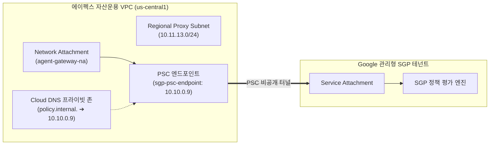

# [Quicklab 가이드] Gemini Enterprise와 Agent Gateway · 시맨틱 거버넌스 정책(SGP)을 활용한 자율형 AI 에이전트 거버넌스

> **총 예상 소요 시간**: 약 **55분** (에이전트 런타임 컨테이너 빌드 및 프로비저닝 대기 시간 15~20분 포함)
> **난이도**: 중급 (Intermediate)
> **대상 환경**: Google Cloud (`us-central1`), Gemini Enterprise, Agent Gateway, Agent Registry, Cloud Run

---

## Step 1. 개요 및 아키텍처 (⏱ 5분)

### 1.1 비즈니스 시나리오: 에이펙스 자산운용 (Apex Asset Management)
금융권에서 자율형 AI 에이전트가 단순 상담을 넘어 **계좌 잔액 조회, 실시간 계좌 이체, 공과금 납부**와 같은 핵심 원장 API를 직접 호출하기 시작하면서, 전통적인 IAM이나 RBAC만으로는 *"누가 호출했는가"*만 확인할 뿐 *"얼마를 어떤 맥락으로 이체하려 하는가"*를 통제하기 어렵습니다.

국내 금융사인 **에이펙스 자산운용**은 고객이 대화만으로 간편 송금과 계좌 관리를 수행할 수 있도록 **Gemini Enterprise** 기반의 대화형 뱅킹 에이전트를 도입했습니다. 금융보안 및 준법감시팀은 보이스피싱 및 고액 오송금 사고를 예방하기 위해 에이전트 코드를 수정하지 않고도 다음 규정을 강제하고자 합니다:

> **핵심 거버넌스 규정**: *"1회 이체 금액이 100만 원(1,000,000 KRW / 1,000 USD)을 초과하는 모든 송금 요청은 네트워크 경계에서 즉시 차단하고 감사 로그를 남긴다."*

---

### 1.2 전체 시스템 아키텍처


---

### 1.3 한눈에 보는 실습 로드맵 (총 9단계 · 55분)

| 단계 | 실행 스크립트 | 핵심 작업 | 예상 시간 | 실무 체크포인트 |
| :---: | :--- | :--- | :---: | :--- |
| **Step 1** | - | 에이펙스 자산운용 시나리오 및 아키텍처 이해 | **5분** | 네트워크 경계 기반 정책 통제 구조 파악 |
| **Step 2** | `01-setup-env.sh` | 필수 API 활성화 및 Gateway 서비스 계정 권한 부여 | **5분** | `roles/agentgateway.serviceAgent` 필수 |
| **Step 3** | `02-setup-networking.sh` | Proxy Subnet, Network Attachment, PSC, DNS 구성 | **7분** | PSC 연결 상태 `ACCEPTED` 확인 |
| **Step 4** | `03-setup-agent-gateway.sh` | `agent-egress` 게이트웨이 및 인가 정책 배포 | **5분** | `policy.internal.` DNS 피어링 연결 |
| **Step 5** | `04-deploy-mcp.sh` | Cloud Run에 뱅킹 MCP 서버 배포 | **5분** | 4대 뱅킹 도구 스키마 응답 확인 |
| **Step 6** | `05-register-mcp.sh` | Agent Registry에 MCP 도구 및 시스템 API 등록 | **5분** | 시스템 엔드포인트 4종 Allowlist 등록 |
| **Step 7** | `06-deploy-agent.sh` | **Gemini Enterprise 에이전트 런타임 배포** | **15~20분** | **프로비저닝 중 절대 중단 금지** |
| **Step 8** | `07-create-sgp-policy.sh` | 고액 이체 차단 시맨틱 거버넌스 정책(SGP) 생성 | **3분** | 런타임 도구 접두사 매칭 확인 |
| **Step 9** | `08-test.sh` | 3-Turn 시나리오 검증 및 Cloud Logging 감사 확인 | **5분** | 소액 이체 `ALLOW` / 고액 이체 `DENY` |

---

## Step 2. 사전 준비 및 환경 / IAM 설정 (⏱ 5분)

### 2.1 레포지토리 클론 및 Google Cloud 인증
Google Cloud SDK(`gcloud`), Python 패키지 매니저(`uv`), 그리고 `google-agents-cli`가 준비된 환경에서 실습 저장소를 복제합니다.

```bash
git clone https://github.com/wxdxh/agent-gateway-sgp.git
cd agent-gateway-sgp

gcloud auth login
gcloud auth application-default login
export PROJECT_ID="your-gcp-project-id"
gcloud config set project "${PROJECT_ID}"
```

### 2.2 필수 API 활성화 및 IAM 권한 부여 (`01-setup-env.sh`)
`01-setup-env.sh`를 실행하면 11개 핵심 API를 활성화하고, Agent Gateway 전용 관리형 서비스 에이전트(`service-PROJECT_NUM@gcp-sa-agentgateway.iam.gserviceaccount.com`)를 생성하여 최소 권한 원칙에 따른 3가지 IAM 역할을 부여합니다.

```bash
./01-setup-env.sh
```

| 부여 IAM 역할 | 권한 목적 |
| :--- | :--- |
| `roles/agentgateway.serviceAgent` | 네트워크 어태치먼트 및 확장 정책 제어 권한 |
| `roles/aiplatform.user` | Gemini Enterprise 기반 SGP 정책 평가 모델 호출 권한 |
| `roles/modelarmor.user` | 콘텐츠 보안 및 가드레일 필터 연동 권한 |

---

## Step 3. 하이브리드 네트워킹 및 Private Service Connect 구성 (⏱ 7분)

Google 관리형 **Agent Gateway**가 에이펙스 자산운용의 VPC 내부로 진입하고, 외부 인터넷을 거치지 않는 **Private Service Connect (PSC)** 전용 터널을 통해 SGP 정책 엔진과 통신하도록 구성합니다.



### 3.1 네트워킹 자동 구성 스크립트 실행 (`02-setup-networking.sh`)

```bash
./02-setup-networking.sh
```

### 3.2 생성 리소스 요약

| 구분 | 리소스 이름 | 주요 설정 | 역할 |
| :--- | :--- | :--- | :--- |
| **Proxy Subnet** | `agent-gateway-proxy-subnet` | `10.11.13.0/24` (`REGIONAL_MANAGED_PROXY`) | 리전 내부 프록시 전용 대역 제공 |
| **Attachment** | `agent-gateway-na` | `ACCEPT_AUTOMATIC` | Agent Gateway가 고객 VPC로 진입하는 연결점 |
| **PSC Endpoint** | `sgp-psc-endpoint` | 정적 IP `sgp-psc-ip` 바인딩 | Google 관리형 SGP 엔진과 비공개 전용 연결 |
| **Cloud DNS** | `policy-internal-zone` | `policy.internal.` A 레코드 | SGP 엔진 도메인을 PSC 내부 IP로 해석 |

> **✅ 검증 포인트**: 스크립트 실행 후 아래 명령어의 결과가 반드시 `ACCEPTED`여야 합니다.
> ```bash
> gcloud compute forwarding-rules describe sgp-psc-endpoint --region=us-central1 --format="value(pscConnectionStatus)"
> ```

---

## Step 4. Agent Gateway 및 콘텐츠 인가 정책 구성 (⏱ 5분)

에이전트의 외부 호출을 가로채는 **Agent Gateway(`agent-egress`)**를 배포하고, 모델 및 도구 호출 페이로드를 `policy.internal:443`으로 전달해 실시간 심사를 수행하는 **Content Authz Policy**를 연결합니다.

### 4.1 Agent Gateway 배포 실행 (`03-setup-agent-gateway.sh`)

```bash
./03-setup-agent-gateway.sh
```

### 4.2 핵심 구성 리소스 3종

| 순서 | 리소스 유형 | 리소스 이름 | 핵심 설정 및 역할 |
| :---: | :--- | :--- | :--- |
| **1** | **Authz Extension** | `sgp-authzextension` | 인가 결정 위임 대상인 `policy.internal:443` 등록 및 `fail-open=false`(장애 시 차단) 적용 |
| **2** | **Egress Gateway** | `agent-egress` | `AGENT_TO_ANYWHERE` 모드로 에이전트 트래픽 제어 및 `policy.internal.` DNS 피어링 수행 |
| **3** | **Content Authz Policy** | `agent-egress-sgp-authzpolicy` | `:generateContent` 및 `:streamGenerateContent` 요청을 감지해 SGP 확장으로 라우팅 |

---

## Step 5. 에이펙스 자산운용 뱅킹 MCP 서버 배포 (⏱ 5분)

에이전트가 호출할 실제 금융 거래 도구를 제공하는 **Model Context Protocol (MCP)** 서버를 Cloud Run에 배포합니다.

### 5.1 제공되는 4대 뱅킹 도구 명세

| 도구 식별자 | 입력 파라미터 | 비즈니스 동작 (에이펙스 자산운용 원장) |
| :--- | :--- | :--- |
| `get_account` | `customer_id` | 김민준 고객(`CUST005`)의 계좌(`ACT-1005`) 정보 및 현재 잔액 조회 |
| `lookup_customer_by_phone` | `phone` | 수취인 전화번호로 등록된 고객 성명 및 계좌 상태 확인 |
| `transfer_to_phone` | `customer_id`, `target_phone`, `amount` | 전화번호 기반 간편 송금 실행 및 거래 고유번호(`TXN-...`) 발급 |
| `pay_bill` | `customer_id`, `biller_name`, `account_number`, `amount` | 기관·가맹점 청구서 납부 및 계좌 잔액 차감 |

### 5.2 로컬 단위 테스트 및 Cloud Run 배포 (`04-deploy-mcp.sh`)

```bash
# 1. 로컬에서 JSON-RPC 2.0 및 도구 동작 단위 테스트
python3 banking-mcp-server/test_server.py

# 2. Cloud Run에 banking-mcp-server 빌드 및 배포
./04-deploy-mcp.sh
```

---

## Step 6. Agent Registry에 MCP 서버 및 시스템 엔드포인트 등록 (⏱ 5분)

배포된 뱅킹 MCP 서버의 스키마를 **Google Cloud Agent Registry**에 등록하고, 제로 트러스트(Default-Deny) 환경에서 에이전트가 정상 작동하기 위해 필요한 Google Cloud 시스템 엔드포인트 4종을 허용 목록(Allowlist)에 추가합니다.

### 6.1 Agent Registry 등록 실행 (`05-register-mcp.sh`)

```bash
./05-register-mcp.sh
```

### 6.2 등록되는 서비스 목록

| 구분 | 서비스 ID | 대상 엔드포인트 | 등록 목적 |
| :---: | :--- | :--- | :--- |
| **MCP 서버** | `banking-mcp-server` | `https://banking-mcp-server-...run.app/mcp` | 4대 뱅킹 도구 스키마 및 JSON-RPC 인터페이스 등록 |
| **시스템 API** | `google-oauth2` | `https://oauth2.googleapis.com` | 런타임 서비스 인증 토큰 발급 허용 |
| **시스템 API** | `google-cloud-logging` | `https://logging.googleapis.com` | Cloud Logging 감사 및 런타임 로그 전송 허용 |
| **시스템 API** | `google-telemetry` | `https://telemetry.googleapis.com` | 트레이스 및 관측성(Observability) 수집 허용 |
| **시스템 API** | `google-aiplatform` | `https://us-central1-aiplatform.googleapis.com` | Gemini Enterprise 모델 추론 엔드포인트 통신 허용 |

---

## Step 7. Gemini Enterprise 에이전트 런타임 배포 (⏱ 15~20분)

> **🚨 필수 가이드라인: 에이전트 구성에 15분 이상 소요됩니다 (중간에 중단하지 마세요)**
> **Gemini Enterprise Agent Runtime**은 컨테이너 이미지 빌드, 격리된 보안 샌드박스 할당, Agent Gateway 프록시 마운트, 그리고 고유한 **Agent Identity(`principal://agents.global...`)** 발급을 순차적으로 진행합니다. 전체 완료까지 **약 15분~20분**이 소요되므로 배포가 진행되는 동안 터미널을 종료하지 마세요.

### 7.1 에이전트 핵심 구조 (`conversational-banking/app/agent.py`)
에이전트는 **Google Agent Development Kit (ADK)**를 기반으로 작성되었으며, `ApiRegistry`를 통해 하드코딩 없이 Agent Registry에서 뱅킹 MCP 도구를 동적으로 연결합니다.

```python
from google.adk.agents import Agent
from google.adk.tools.api_registry import ApiRegistry

api_registry = ApiRegistry(
    api_registry_project_id=PROJECT_ID,
    location=LOCATION,
)
banking_tools = api_registry.get_toolset(mcp_server_name=MCP_SERVER_NAME)

root_agent = Agent(
    name="conversational_banking",
    model=Gemini(model="gemini-2.5-flash"),
    instruction="""당신은 에이펙스 자산운용(Apex Asset Management)의 전문 AI 뱅킹 어시스턴트입니다.
    1. 고객이 고객번호(예: CUST005)를 제시하면 get_account로 계좌와 잔액을 확인하세요.
    2. 송금 요청 시 transfer_to_phone 도구를 호출하세요.
    3. 거버넌스 정책(SGP)에 의해 거래가 차단된 경우, 차단 사유를 고객에게 명확하고 정중하게 안내하세요.""",
    tools=[banking_tools],
)
```

### 7.2 에이전트 배포 스크립트 실행 (`06-deploy-agent.sh`)
아래 스크립트는 에이전트를 Gemini Enterprise 런타임에 배포한 뒤, 발급된 **Agent Identity**에 Cloud Run 뱅킹 MCP 서버를 호출할 수 있는 `roles/run.invoker` 권한을 자동으로 부여합니다.

```bash
./06-deploy-agent.sh
```

---

## Step 8. 시맨틱 거버넌스 정책(SGP) 생성 (⏱ 3분)

애플리케이션 코드를 전혀 수정하지 않고, **자연어 비즈니스 규정**만으로 고액 이체를 원천 차단하는 시맨틱 거버넌스 정책(`high-value-limit`)을 생성합니다.

### 8.1 SGP 정책 생성 스크립트 실행 (`07-create-sgp-policy.sh`)

```bash
./07-create-sgp-policy.sh
```

### 8.2 자연어 제약 조건 설정 상세

```bash
# ADK 런타임이 부여하는 도구 네임스페이스 접두사(Banking_MCP_Server_)를 포함하여 지정합니다.
TOOL_NAME="Banking_MCP_Server_transfer_to_phone"

gcloud beta ai semantic-governance-policies create high-value-limit \
  --project="${PROJECT_ID}" \
  --location="${LOCATION}" \
  --display-name="에이펙스 자산운용 고액 이체 한도 정책" \
  --agent="projects/${PROJECT_ID}/locations/${LOCATION}/agents/${AGENT_ID}" \
  --mcp-tools="mcp-server=projects/${PROJECT_ID}/locations/${LOCATION}/mcpServers/${MCP_SERVER_NAME},tools=${TOOL_NAME}" \
  --natural-language-constraint="1회 이체 금액이 1,000,000 KRW(100만 원) 또는 1,000 USD를 초과하는 모든 송금을 차단합니다."
```

> **💡 실무 체크포인트**: ADK가 Agent Registry에서 `Banking MCP Server`의 도구를 불러올 때 런타임 도구 이름은 `Banking_MCP_Server_transfer_to_phone`이 됩니다. 정책의 `tools` 항목에 이 전체 이름을 등록해야 SGP 엔진이 송금 도구 호출을 정확히 식별하여 심사합니다.

---

## Step 9. 종단간(End-to-End) 3-Turn 시나리오 검증 및 감사 로그 확인 (⏱ 5분)

모든 인프라와 정책 배포가 완료되었습니다. 에이펙스 자산운용의 고객 **김민준(`CUST005`)** 시나리오로 3단계 대화를 실행하여 소액 이체 허용(`ALLOW`)과 고액 이체 차단(`DENY`)을 검증합니다.

### 9.1 자동화 검증 스크립트 실행 (`08-test.sh`)
`./08-test.sh`(내부적으로 `run_tests.py` 실행)를 호출하면 Gemini Enterprise 에이전트 런타임에 Turn 1~3 대화를 연속 전송하고 Cloud Logging 감사 로그까지 한 번에 검증합니다.

```bash
./08-test.sh
```

### 9.2 3-Turn 시나리오별 기대 결과 요약

| 대화 순서 | 고객 입력 프롬프트 | SGP 판정 | 에이전트 최종 응답 |
| :---: | :--- | :---: | :--- |
| **Turn 1**<br/>(본인 확인) | `저는 고객번호 CUST005입니다`<br/>*(또는 `I am customer CUST005`)* | **`ALLOW`** | 안녕하세요! 계좌(`ACT-1005`)의 현재 잔액은 **10,000,000원(10,000 USD)**입니다. 무엇을 도와드릴까요? |
| **Turn 2**<br/>(소액 송금) | `555-0001로 5만 원(50) 이체해 줘`<br/>*(또는 `transfer 50 to 555-0001`)* | **`ALLOW`** | 수취인(`555-0001`)에게 정상 이체되었습니다. 거래번호: `TXN-C0832A85`, 남은 잔액: **9,950,000원(9,950 USD)** |
| **Turn 3**<br/>(고액 차단) | `555-0002로 200만 원(2000) 이체해 줘`<br/>*(또는 `transfer 2000 to 555-0002`)* | **`DENY`** | 죄송합니다. 요청하신 이체 금액이 **'고액 이체 한도 정책(High Value Transfer Limit)'의 1회 한도(100만 원 / 1,000 USD)를 초과**하여 거래를 진행할 수 없습니다. |

### 9.3 Cloud Logging 시맨틱 거버넌스 감사 로그 조회

```bash
gcloud logging read 'logName="projects/'"${PROJECT_ID}"'/logs/semantic-governance-policy" AND jsonPayload.verdict:*' \
  --limit=3 \
  --format=json
```

기록된 `DENY` 감사 로그 페이로드 예시:
```json
{
  "jsonPayload": {
    "verdict": "DENY",
    "userFacingDenialMessage": "The requested transfer amount of 2000 USD exceeds the maximum allowed limit of 1000 USD stipulated by the 'High Value Transfer Limit' policy.",
    "evaluations": [
      {
        "actionName": "Banking_MCP_Server_transfer_to_phone",
        "toolName": "Banking_MCP_Server_transfer_to_phone",
        "verdict": "DENY",
        "rationale": "The requested transfer amount exceeds the maximum allowed limit stipulated by the 'High Value Transfer Limit' policy."
      }
    ],
    "token_usage": 3164
  },
  "logName": "projects/elevate-security-dhwee/logs/semantic-governance-policy"
}
```

---

## Step 10. 실습 리소스 정리 (`99-cleanup.sh`)

실습을 모두 마친 후 지속적인 과금을 방지하기 위해 생성된 클라우드 리소스를 역순으로 안전하게 삭제합니다.

```bash
./99-cleanup.sh
```
