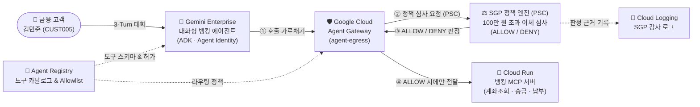
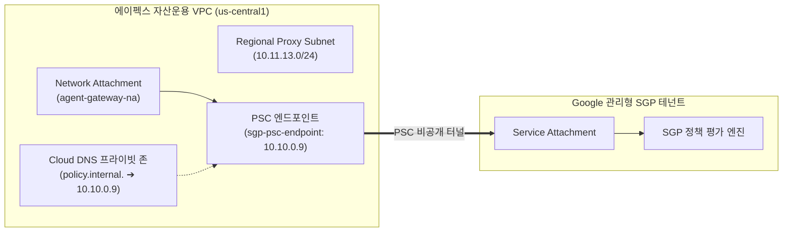

# [Quicklab 가이드] Gemini Enterprise와 Agent Gateway · 시맨틱 거버넌스 정책(SGP)을 활용한 자율형 AI 에이전트 거버넌스

> **총 예상 소요 시간**: 약 **45분** (에이전트 런타임 비동기 조기 배포 및 SGP 인프라 병렬 구성으로 대기 시간 단축)
> **난이도**: 중급 (Intermediate)
> **대상 환경**: Google Cloud (`us-central1`), Gemini Enterprise, Agent Gateway, Agent Registry, Cloud Run
> **웹 버전 가이드 (Cloud Run)**: [https://agent-gateway-codelab-1080321871308.us-central1.run.app](https://agent-gateway-codelab-1080321871308.us-central1.run.app)

---

## Step 1. 개요 및 아키텍처 (⏱ 5분)

### 1.1 비즈니스 시나리오: 에이펙스 자산운용 (Apex Asset Management)
금융권에서 자율형 AI 에이전트가 단순 상담을 넘어 **계좌 잔액 조회, 실시간 계좌 이체, 공과금 납부**와 같은 핵심 원장 API를 직접 호출하기 시작하면서, 전통적인 IAM이나 RBAC만으로는 *"누가 호출했는가"*만 확인할 뿐 *"얼마를 어떤 맥락으로 이체하려 하는가"*를 통제하기 어렵습니다.

국내 금융사인 **에이펙스 자산운용**은 고객이 대화만으로 간편 송금과 계좌 관리를 수행할 수 있도록 **Gemini Enterprise** 기반의 대화형 뱅킹 에이전트를 도입했습니다. 금융보안 및 준법감시팀은 보이스피싱 및 고액 오송금 사고를 예방하기 위해 에이전트 코드를 수정하지 않고도 다음 규정을 강제하고자 합니다:

> **핵심 거버넌스 규정**: *"1회 이체 금액이 100만 원(1,000,000 KRW / 1,000 USD)을 초과하는 모든 송금 요청은 네트워크 경계에서 즉시 차단하고 감사 로그를 남긴다."*

---

### 1.2 전체 시스템 아키텍처



---

### 1.3 한눈에 보는 실습 로드맵 (병렬 파이프라인 최적화 · 총 9단계 · 약 45분)

> **💡 대기 시간 단축을 위한 병렬 파이프라인 설계**
> Gemini Enterprise Agent Runtime 프로비저닝은 컨테이너 빌드 및 샌드박스 할당으로 인해 약 15~20분이 소요됩니다. 본 실습은 에이전트 배포에 필요한 최소 선행 리소스(`agent-egress` 게이트웨이 및 MCP 도구 등록)만 먼저 구성한 뒤 **Step 6(`05-deploy-agent.sh`)에서 비동기(`--no-wait`)로 에이전트 배포를 조기 시작**합니다. 이후 에이전트가 백그라운드에서 빌드되는 동안 **Step 7(SGP PSC 네트워킹 및 DNS 구성)**과 **Step 8(인가 확장 및 SGP 정책 생성)**을 병렬로 진행하여 실습 유휴 대기 시간을 대폭 단축합니다.

| 단계 | 실행 스크립트 | 핵심 작업 | 예상 시간 | 실무 체크포인트 |
| :---: | :--- | :--- | :---: | :--- |
| **Step 1** | - | 에이펙스 자산운용 시나리오 및 아키텍처 이해 | **5분** | 네트워크 경계 기반 정책 통제 구조 파악 |
| **Step 2** | `01-setup-env.sh` | 필수 API 활성화 및 Gateway 서비스 계정 권한 부여 | **3분** | `roles/agentgateway.serviceAgent` 필수 |
| **Step 3** | `02-setup-agent-gateway.sh` | Proxy-Only 서브넷, Network Attachment, `agent-egress` 생성 | **3분** | `AGENT_TO_ANYWHERE` Egress 게이트웨이 생성 |
| **Step 4** | `03-deploy-mcp.sh` | Cloud Run에 뱅킹 MCP 서버 배포 및 Invoker 권한 부여 | **3분** | 4대 뱅킹 도구 스키마 응답 확인 |
| **Step 5** | `04-register-mcp.sh` | Agent Registry에 MCP 도구 및 4대 시스템 API 등록 | **3분** | 시스템 엔드포인트 4종 Allowlist 등록 |
| **Step 6** | `05-deploy-agent.sh` | **🚀 Gemini Enterprise 에이전트 런타임 조기 비동기 배포 시작** | **2분 (백그라운드 15분)** | **`--no-wait`으로 배포 시작 후 즉시 Step 7 진행** |
| **Step 7** | `06-setup-sgp-networking.sh` | **(병렬 진행 1)** SGP 엔진 활성화, PSC 엔드포인트, 프라이빗 DNS 구성 | **5분** | PSC 연결 상태 `ACCEPTED` 및 `policy.internal.` 매핑 확인 |
| **Step 8** | `07-create-sgp-policy.sh` | **(병렬 진행 2)** AuthzExtension, AuthzPolicy 및 고액 이체 차단 SGP 정책 생성 | **5분** | 에이전트 등록 완료 확인 후 `high-value-limit` 정책 바인딩 |
| **Step 9** | `08-test.sh` | 3-Turn 시나리오 검증 및 Cloud Logging 감사 확인 | **5분** | 소액 이체 `ALLOW` / 고액 이체 `DENY` |

---

## Step 2. 사전 준비 및 환경 / IAM 설정 (⏱ 3분)

### 2.1 레포지토리 클론 및 Google Cloud 인증
Google Cloud SDK(`gcloud`), Python 패키지 매니저(`uv`), 그리고 `google-agents-cli`가 준비된 환경에서 실습 저장소를 복제합니다.

```bash
git clone https://github.com/wxdxh/agent-gateway-sgp.git
cd agent-gateway-sgp

gcloud auth login
gcloud auth application-default login
export PROJECT_ID="your-gcp-project-id"
gcloud config set project "${PROJECT_ID}"
```

### 2.2 스크립트 실행 (`01-setup-env.sh`)

```bash
./01-setup-env.sh
```

### 2.3 🔍 스크립트 내부 구동 원리 (`env.sh` & `01-setup-env.sh`)
단순히 스크립트를 실행하는 것에 그치지 않고, 스크립트 내부에서 어떤 설정이 수행되는지 이해하는 것이 중요합니다.

#### ① 공통 환경 변수 자동 감지 (`env.sh`)
모든 단계별 스크립트가 최상단에서 `source env.sh`로 불러오는 파일입니다. 프로젝트 번호(`PROJECT_NUM`)를 기반으로 Google 관리형 Agent Gateway 서비스 계정(`AGW_SA`)을 조합하고, 프로젝트 내 활성 VPC 네트워크와 서브넷을 자동으로 탐지합니다.

```bash
export PROJECT_ID="${PROJECT_ID:-$(gcloud config get-value project 2>/dev/null)}"
export PROJECT_NUM="$(gcloud projects describe "${PROJECT_ID}" --format="value(projectNumber)")"
export LOCATION="${LOCATION:-us-central1}"
export AGW_SA="serviceAccount:service-${PROJECT_NUM}@gcp-sa-agentgateway.iam.gserviceaccount.com"

# default 네트워크가 있으면 사용하고, 없으면 프로젝트의 첫 번째 VPC/서브넷을 자동 선택
if gcloud compute networks describe default --project="${PROJECT_ID}" &>/dev/null; then
  DEFAULT_NET="default"; DEFAULT_SUBNET="default"
else
  DEFAULT_NET="$(gcloud compute networks list --project="${PROJECT_ID}" --format="value(name)" | head -n 1)"
  DEFAULT_SUBNET="$(gcloud compute networks subnets list --project="${PROJECT_ID}" --regions="${LOCATION}" --network="${DEFAULT_NET}" --format="value(name)" | head -n 1)"
fi
```

#### ② 필수 API 16종 활성화 및 서비스 ID 프로비저닝 (`01-setup-env.sh`)
네트워크 보안(`networksecurity`, `networkservices`), 카탈로그(`agentregistry`), 런타임(`aiplatform`, `run`), 관측성(`telemetry`, `logging`) API를 활성화한 뒤, **Network Services 서비스 에이전트 ID**를 명시적으로 생성합니다.

```bash
# Network Services 관리형 서비스 에이전트(service-PROJECT_NUM@gcp-sa-agentgateway...) 생성
gcloud beta services identity create \
  --service=networkservices.googleapis.com \
  --project="${PROJECT_ID}" || true

# 생성된 Agent Gateway 서비스 에이전트에 3대 핵심 IAM 역할 부여
for ROLE in "roles/agentgateway.serviceAgent" "roles/aiplatform.user" "roles/modelarmor.user"; do
  gcloud projects add-iam-policy-binding "${PROJECT_ID}" \
    --member="${AGW_SA}" \
    --role="${ROLE}" \
    --condition=None --quiet
done
```

| 부여 IAM 역할 | 왜 필요한가요? (미부여 시 증상) |
| :--- | :--- |
| `roles/agentgateway.serviceAgent` | Agent Gateway가 고객 VPC의 Network Attachment에 인터페이스를 연결하고 트래픽을 라우팅하기 위한 필수 권한 |
| `roles/aiplatform.user` | 게이트웨이가 가로챈 도구 호출을 Gemini Enterprise 기반 SGP 정책 평가 모델로 전달해 추론하기 위한 권한 |
| `roles/modelarmor.user` | 프롬프트 및 응답 페이로드의 콘텐츠 보안 가드레일(Model Armor) 필터를 호출하기 위한 권한 |

---

## Step 3. Agent Gateway Egress 기반 구축 (⏱ 3분)

에이전트 런타임 배포(`05-deploy-agent.sh`)를 조기에 시작하려면, 에이전트가 연결될 **Agent Gateway(`agent-egress`)**와 이를 뒷받침하는 VPC 프록시 서브넷 및 Network Attachment가 먼저 준비되어야 합니다.

### 3.1 스크립트 실행 (`02-setup-agent-gateway.sh`)

```bash
./02-setup-agent-gateway.sh
```

### 3.2 🔍 스크립트 내부 구동 원리 (`02-setup-agent-gateway.sh`)

이 스크립트는 에이전트의 아웃바운드(Egress) 통제를 담당하는 핵심 게이트웨이 인프라 3가지를 생성합니다:

#### ① Regional Managed Proxy Subnet 및 Network Attachment 생성
Agent Gateway(Google 관리형 테넌트에서 실행됨)가 고객 VPC 내부의 프라이빗 리소스(후속 단계에서 구성할 SGP PSC 엔드포인트)와 통신하려면, VPC 내부에 프록시 전용 대역(`REGIONAL_MANAGED_PROXY`)과 진입 인터페이스인 **Network Attachment(`agent-gateway-na`)**가 있어야 합니다.

```bash
# 1. 리전 내부 Envoy 프록시 전용 대역(10.11.13.0/24) 할당
gcloud compute networks subnets create proxy-only-subnet \
  --network="${NETWORK_NAME}" --region="${LOCATION}" \
  --range="10.11.13.0/24" --purpose=REGIONAL_MANAGED_PROXY --role=ACTIVE

# 2. Agent Gateway가 고객 VPC에 자동으로 연결(ACCEPT_AUTOMATIC)될 수 있는 어태치먼트 생성
gcloud compute network-attachments create agent-gateway-na \
  --region="${LOCATION}" --subnets="${SUBNET_NAME}" \
  --connection-preference=ACCEPT_AUTOMATIC
```

#### ② Egress Agent Gateway 생성 (`agent-gateway-vpc-egress.yaml`)
- `governedAccessPath: AGENT_TO_ANYWHERE`: 에이전트에서 외부(클라우드 API 및 MCP 서버)로 나가는 모든 이그레스 트래픽을 통제합니다.
- `networkConfig.egress.networkAttachment`: 방금 만든 `agent-gateway-na`를 통해 고객 VPC로 진입합니다.
- `dnsPeeringConfig`: 게이트웨이가 고객 VPC의 Cloud DNS를 참조하여 `policy.internal.` 도메인(Step 7에서 생성)을 해석할 수 있도록 DNS 피어링을 미리 선언합니다.

```yaml
name: projects/${PROJECT_ID}/locations/${LOCATION}/agentGateways/agent-egress
protocols:
  - MCP
googleManaged:
  governedAccessPath: AGENT_TO_ANYWHERE
registries:
  - //agentregistry.googleapis.com/projects/${PROJECT_ID}/locations/${LOCATION}
networkConfig:
  egress:
    networkAttachment: projects/${PROJECT_ID}/regions/${LOCATION}/networkAttachments/agent-gateway-na
  dnsPeeringConfig:
    domains:
      - policy.internal.
    targetProject: ${PROJECT_ID}
    targetNetwork: projects/${PROJECT_ID}/global/networks/${NETWORK_NAME}
```

```bash
gcloud network-services agent-gateways import agent-egress \
  --source="agent-gateway-vpc-egress.yaml" \
  --location="${LOCATION}" --project="${PROJECT_ID}"
```

---

## Step 4. 에이펙스 자산운용 뱅킹 MCP 서버 배포 (⏱ 3분)

에이전트가 호출할 실제 금융 거래 도구를 제공하는 **Model Context Protocol (MCP)** 서버를 Cloud Run에 배포합니다.

### 4.1 스크립트 실행 (`03-deploy-mcp.sh`)

```bash
# (선택) 로컬에서 JSON-RPC 2.0 및 도구 동작 단위 테스트
python3 banking-mcp-server/test_server.py

# Cloud Run에 banking-mcp-server 빌드 및 배포
./03-deploy-mcp.sh
```

### 4.2 🔍 스크립트 및 서버 내부 구동 원리 (`banking-mcp-server/server.py` & `03-deploy-mcp.sh`)

#### ① FastAPI 기반 MCP 서버의 2가지 핵심 엔드포인트 (`banking-mcp-server/server.py`)
- **`GET /tools`**: Step 5에서 Agent Registry에 도구 스키마를 자동 추출·등록할 수 있도록 4개 도구의 이름, 설명, `inputSchema` 배열을 JSON으로 반환합니다.
- **`POST /mcp`**: 에이전트 런타임이 실시간으로 호출하는 표준 **MCP JSON-RPC 2.0** 엔드포인트입니다. `initialize`, `tools/list`, `tools/call` 메서드를 처리하며 인메모리 원장(`CUSTOMERS` 딕셔너리)에서 잔액 조회 및 차감을 수행합니다.

| 도구 식별자 | 입력 파라미터 | 비즈니스 동작 (에이펙스 자산운용 원장) |
| :--- | :--- | :--- |
| `get_account` | `customer_id` | 김민준 고객(`CUST005`)의 계좌(`ACT-1005`) 정보 및 현재 잔액 조회 |
| `lookup_customer_by_phone` | `phone` | 수취인 전화번호로 등록된 고객 성명 및 계좌 상태 확인 |
| `transfer_to_phone` | `customer_id`, `target_phone`, `amount` | 전화번호 기반 간편 송금 실행 및 거래 고유번호(`TXN-...`) 발급 |
| `pay_bill` | `customer_id`, `biller_name`, `account_number`, `amount` | 기관·가맹점 청구서 납부 및 계좌 잔액 차감 |

#### ② Cloud Run 배포 및 게이트웨이 호출 권한 부여 (`03-deploy-mcp.sh`)
Cloud Run에 컨테이너를 배포한 뒤 배포된 URL(`MCP_URL`)을 `.env.runtime` 파일에 기록하고, Agent Gateway 서비스 계정(`AGW_SA`)에 `roles/run.servicesInvoker` 권한을 부여하여 게이트웨이가 MCP 서버로 패킷을 전달할 수 있게 합니다.

```bash
gcloud run deploy banking-mcp-server --source=. --region="${LOCATION}" --allow-unauthenticated --quiet

# 배포된 URL을 후속 스크립트에서 참조할 수 있도록 .env.runtime에 저장
export MCP_URL="$(gcloud run services describe banking-mcp-server --region="${LOCATION}" --format="value(status.url)")"
echo "export MCP_URL=\"${MCP_URL}\"" >> "${SCRIPT_DIR}/.env.runtime"

# Agent Gateway 서비스 에이전트에 Cloud Run 호출 권한 부여
gcloud run services add-iam-policy-binding banking-mcp-server \
  --region="${LOCATION}" --member="${AGW_SA}" --role="roles/run.servicesInvoker"
```

---

## Step 5. Agent Registry에 MCP 서버 및 시스템 엔드포인트 등록 (⏱ 3분)

배포된 뱅킹 MCP 서버의 스키마를 **Google Cloud Agent Registry**에 등록하고, 제로 트러스트(Default-Deny) 환경에서 에이전트가 정상 작동하기 위해 필요한 Google Cloud 시스템 엔드포인트 4종을 허용 목록(Allowlist)에 추가합니다.

### 5.1 스크립트 실행 (`04-register-mcp.sh`)

```bash
./04-register-mcp.sh
```

### 5.2 🔍 스크립트 내부 구동 원리 (`04-register-mcp.sh`)

#### ① MCP 도구 명세 추출 및 Agent Registry 서비스 생성
MCP 서버의 `GET /tools` 응답을 가져와 Agent Registry가 요구하는 `{"tools": [...]}` 포맷의 `toolspec.json` 파일로 변환한 뒤 등록합니다. 등록이 완료되면 플랫폼이 부여한 고유 리소스 ID(`MCP_SERVER_NAME`, 예: `agentregistry-00000000-...`)를 조회해 `.env.runtime`에 저장합니다.

```bash
# 1. /tools 출력을 {"tools": [...]} 구조의 toolspec.json으로 래핑
curl -fsS -H "Authorization: Bearer ${ID_TOKEN}" "${MCP_URL}/tools" | \
  python3 -c 'import sys, json; tools=json.load(sys.stdin); json.dump({"tools": tools}, open("toolspec.json", "w"))'

# 2. Agent Registry에 JSON-RPC 인터페이스 및 도구 스키마 등록
gcloud alpha agent-registry services create banking-mcp-server \
  --location="${LOCATION}" \
  --display-name="Banking MCP Server" \
  --interfaces=url="${MCP_URL}/mcp",protocolBinding=JSONRPC \
  --mcp-server-spec-type=tool-spec \
  --mcp-server-spec-content="toolspec.json"
```

#### ② Google Cloud 시스템 엔드포인트 4종 Allowlist 등록 및 `roles/iap.egressor` 바인딩
`agent-egress` 게이트웨이는 **기본 거부(Default-Deny)** 방식으로 동작하므로, Agent Registry에 등록되지 않은 외부 도메인은 Google Cloud 자체 API라 할지라도 모두 차단됩니다. 따라서 스크립트는 아래 4개 필수 시스템 엔드포인트를 등록하고, **IAP Egressor(`roles/iap.egressor`)** 권한을 게이트웨이 SA와 에이전트 런타임 SA(`service-PROJECT_NUM@gcp-sa-aiplatform-re.iam.gserviceaccount.com`)에 바인딩합니다.

```bash
ENDPOINTS=(
  "Gemini Enterprise Locational API | https://${LOCATION}-aiplatform.googleapis.com"
  "Cloud Trace API | https://telemetry.googleapis.com"
  "Cloud Logging API | https://logging.googleapis.com"
  "Agent Registry API | https://agentregistry.googleapis.com"
)

# 각 엔드포인트를 등록한 뒤 IAP Egressor 권한을 부여하여 게이트웨이 통과 허용
gcloud alpha iap web add-iam-policy-binding \
  --resource-type=agent-registry --endpoint="${ep_id}" --region="${LOCATION}" \
  --member="serviceAccount:service-${PROJECT_NUM}@gcp-sa-aiplatform-re.iam.gserviceaccount.com" \
  --role="roles/iap.egressor"
```

---

## Step 6. 🚀 Gemini Enterprise 에이전트 런타임 조기 비동기 배포 시작 (⏱ 2분 · 백그라운드 15~20분)

> **💡 핵심 시간 단축 포인트: `--no-wait` 비동기 배포 트리거 후 즉시 Step 7 진행**
> **Gemini Enterprise Agent Runtime**은 컨테이너 이미지 빌드, 격리된 보안 샌드박스 할당, Agent Gateway 프록시 마운트, 그리고 고유한 **Agent Identity(`principal://agents.global...`)** 발급까지 백엔드에서 **약 15~20분**이 소요됩니다.
> `05-deploy-agent.sh`는 `--no-wait` 플래그를 사용하여 **백그라운드 배포 작업만 즉시 트리거하고 종료(약 1~2분)**됩니다. 스크립트가 완료되면 에이전트가 만들어질 때까지 기다리지 말고 **곧바로 Step 7(`06-setup-sgp-networking.sh`)로 넘어가 SGP 네트워킹 및 정책 구성을 병렬로 진행**하세요!

### 6.1 스크립트 실행 (`05-deploy-agent.sh`)

```bash
./05-deploy-agent.sh
```

### 6.2 🔍 스크립트 및 에이전트 내부 구동 원리 (`05-deploy-agent.sh` & `app/agent.py`)

#### ① Agent Gateway TLS Inspection Root CA 인증서 추출 및 컨테이너 주입
Agent Gateway는 에이전트가 외부로 보내는 HTTPS 패킷 내부의 JSON 페이로드(도구 이름 및 이체 금액)를 검사하기 위해 **TLS 인터셉션(SSL 복호화 후 재암호화)**을 수행합니다. 에이전트 컨테이너가 게이트웨이의 사설 인증서를 신뢰할 수 있도록, `05-deploy-agent.sh`는 Step 3에서 생성한 `agent-egress` 리소스에서 Root CA 인증서를 추출하여 `conversational-banking/agent-gateway-ca.crt`로 저장합니다.

```bash
# Agent Gateway의 사설 Root CA 인증서를 추출하여 에이전트 빌드 디렉터리에 저장
gcloud network-services agent-gateways describe agent-egress \
  --location="${LOCATION}" --project="${PROJECT_ID}" \
  --format="value(agentGatewayCard.rootCertificates[0])" > conversational-banking/agent-gateway-ca.crt
```

이 인증서는 `conversational-banking/Dockerfile` 빌드 시점에 OS 시스템 신뢰 저장소(`ca-certificates`)에 등록됩니다.

#### ② `agents-cli deploy` 명령의 핵심 플래그 해설
```bash
agents-cli deploy \
  --project="${PROJECT_ID}" \
  --region="${LOCATION}" \
  --deployment-target="agent_runtime" \
  --agent-identity \
  --agent-gateway-egress="projects/${PROJECT_ID}/locations/${LOCATION}/agentGateways/agent-egress" \
  --update-env-vars="MCP_SERVER_NAME=${MCP_SERVER_NAME},GOOGLE_CLOUD_LOCATION=${LOCATION},PROJECT_ID=${PROJECT_ID},GOOGLE_API_USE_MTLS_ENDPOINT=never,GOOGLE_API_USE_CLIENT_CERTIFICATE=false" \
  --no-wait
```
- `--agent-identity`: 에이전트 인스턴스만의 고유 암호화 ID(`principal://agents.global.org-...`)를 프로비저닝합니다.
- `--agent-gateway-egress`: 에이전트 런타임 샌드박스의 모든 아웃바운드 트래픽이 `agent-egress` 게이트웨이를 강제로 경유하도록 네트워크를 바인딩합니다.
- `--update-env-vars="MCP_SERVER_NAME=..."`: Step 5에서 등록된 MCP 서버 ID를 환경 변수로 전달하여 에이전트가 시작할 때 동적으로 도구 목록을 가져오게 합니다.
- `--no-wait`: 백엔드 프로비저닝 완료를 블로킹 대기하지 않고 즉시 제어권을 반환하여, 실습자가 Step 7과 Step 8을 동시에 진행할 수 있도록 합니다.

#### ③ ADK 에이전트의 동적 도구 바인딩 및 Cloud Run 인증 (`conversational-banking/app/agent.py`)
에이전트 코드는 MCP 서버의 URL을 하드코딩하지 않고 `ApiRegistry`에서 `MCP_SERVER_NAME`으로 도구 세트를 조회합니다. 또한 Cloud Run으로 요청을 보낼 때 Compute Engine 메타데이터 서버에서 대상 URL을 Audience로 하는 **OIDC ID 토큰**을 자동 발급받아 `Authorization: Bearer` 헤더에 주입합니다.

```python
from google.adk.agents import Agent
from google.adk.tools.api_registry import ApiRegistry

# Agent Registry 카탈로그에서 MCP 도구 세트를 동적으로 로드
api_registry = ApiRegistry(api_registry_project_id=PROJECT_ID, location=LOCATION)
banking_tools = api_registry.get_toolset(mcp_server_name=MCP_SERVER_NAME)

root_agent = Agent(
    name="conversational_banking",
    model=Gemini(model="gemini-2.5-flash"),
    instruction="""당신은 에이펙스 자산운용(Apex Asset Management)의 전문 AI 뱅킹 어시스턴트입니다.
    1. 고객이 고객번호(예: CUST005)를 제시하면 get_account로 계좌와 잔액을 확인하세요.
    2. 송금 요청 시 transfer_to_phone 도구를 호출하세요.
    3. 거버넌스 정책(SGP)에 의해 거래가 차단된 경우, 차단 사유를 고객에게 명확하고 정중하게 안내하세요.""",
    tools=[banking_tools],
)
```

---

## Step 7. (병렬 진행 1) SGP 정책 엔진 활성화 · PSC 엔드포인트 및 프라이빗 DNS 구성 (⏱ 5분)

백그라운드에서 Gemini Enterprise 에이전트 런타임이 빌드되는 동안, **Agent Gateway(`agent-egress`)**가 외부 인터넷을 거치지 않는 **Private Service Connect (PSC)** 전용 터널을 통해 SGP 정책 엔진과 통신하도록 구성합니다.



### 7.1 스크립트 실행 (`06-setup-sgp-networking.sh`)

```bash
./06-setup-sgp-networking.sh
```

### 7.2 🔍 스크립트 내부 구동 원리 (`06-setup-sgp-networking.sh`)

#### ① SGP 정책 엔진 활성화 및 Service Attachment 동적 조회
Google이 관리하는 SGP 엔진은 프로젝트별로 고유한 테넌트 **PSC Service Attachment URI**(`projects/.../serviceAttachments/k8s1-sa-...`)를 제공합니다. 스크립트는 엔진을 활성화하고 이 URI를 동적으로 추출합니다.

```bash
# SGP 정책 엔진을 활성화하고 할당된 PSC Service Attachment 주소를 동적 조회
gcloud beta ai semantic-governance-policy-engine update --location="${LOCATION}" --project="${PROJECT_ID}" --quiet
SERVICE_ATTACHMENT="$(gcloud beta ai semantic-governance-policy-engine describe \
  --location="${LOCATION}" --project="${PROJECT_ID}" --format="value(pscServiceAttachment)")"
```

#### ② PSC 정적 IP 예약 및 Forwarding Rule(`sgp-psc-endpoint`) 생성
고객 서브넷 내부에 고정 IP(`sgp-psc-ip`, 예: `10.10.0.9`)를 예약하고, 해당 IP로 들어오는 패킷을 Google 관리형 SGP 엔진의 `SERVICE_ATTACHMENT`로 직결하는 PSC 엔드포인트를 생성합니다.

```bash
gcloud compute addresses create sgp-psc-ip \
  --region="${LOCATION}" --subnet="${SUBNET_NAME}" --purpose=GCE_ENDPOINT

gcloud compute forwarding-rules create sgp-psc-endpoint \
  --region="${LOCATION}" --network="${NETWORK_NAME}" \
  --address="sgp-psc-ip" --target-service-attachment="${SERVICE_ATTACHMENT}"
```

#### ③ Cloud DNS 프라이빗 존(`policy.internal.`) 매핑
Agent Gateway의 확장 정책은 `https://policy.internal`이라는 고정 도메인 이름으로 SGP 엔진을 호출합니다. 따라서 VPC 내부에서 `policy.internal.` 질의가 `PSC_IP`(`10.10.0.9`)로 응답되도록 프라이빗 DNS 존과 A 레코드를 구성합니다.

```bash
gcloud dns managed-zones create policy-engine-zone \
  --dns-name="policy.internal." --visibility=private --networks="${NETWORK_NAME}"

gcloud dns record-sets create policy.internal. \
  --zone=policy-engine-zone --type=A --ttl=300 --rrdatas="${PSC_IP}"
```

> **✅ 검증 포인트**: 아래 명령어 실행 시 상태가 `ACCEPTED`로 출력되면 비공개 PSC 터널이 정상 개통된 것입니다.
> ```bash
> gcloud compute forwarding-rules describe sgp-psc-endpoint --region=us-central1 --format="value(pscConnectionStatus)"
> ```

---

## Step 8. (병렬 진행 2) 콘텐츠 인가 정책 연동 및 시맨틱 거버넌스 정책(SGP) 생성 (⏱ 5분)

이제 `agent-egress` 게이트웨이가 모델 및 도구 호출 페이로드를 `policy.internal`로 전달해 실시간 심사를 수행하도록 **AuthzExtension** 및 **Content Authz Policy**를 연결하고, **자연어 비즈니스 규정**만으로 고액 이체를 원천 차단하는 시맨틱 거버넌스 정책(`high-value-limit`)을 생성합니다.

### 8.1 스크립트 실행 (`07-create-sgp-policy.sh`)

```bash
./07-create-sgp-policy.sh
```

### 8.2 🔍 스크립트 내부 구동 원리 (`07-create-sgp-policy.sh`)

#### ① SGP Authorization Extension 등록 (`sgp-authzextension`)
게이트웨이가 트래픽을 가로챘을 때 외부 심사관(Callout Server)으로 호출할 대상을 `policy.internal`로 지정합니다. 특히 **`"failOpen": false`**로 설정하여, 정책 엔진 장애나 위반 시 트래픽을 무조건 차단(Fail-Closed)하도록 강제합니다.

```bash
curl -fsS -X POST \
  "https://networkservices.googleapis.com/v1beta1/projects/${PROJECT_ID}/locations/${LOCATION}/authzExtensions?authzExtensionId=sgp-authzextension" \
  -H "Authorization: Bearer $(gcloud auth print-access-token)" \
  -H "Content-Type: application/json" \
  -d '{
    "service": "policy.internal",
    "authority": "policy.internal",
    "failOpen": false,
    "loadBalancingScheme": "LOAD_BALANCING_SCHEME_UNSPECIFIED"
  }'
```

#### ② Content Authorization Policy 바인딩 (`agent-egress-sgp-authzpolicy.yaml`)
`agent-egress` 게이트웨이를 통과하는 트래픽 중 **CEL(Common Expression Language) 조건식**과 일치하는 요청만 골라내어 `sgp-authzextension`으로 보냅니다.
- `when` 조건식 해설: gRPC가 아닌 일반 HTTP/JSON 요청이면서 경로가 `:generateContent` 또는 `:streamGenerateContent`로 끝나는 모델 추론/도구 결정 트래픽을 정확히 인터셉트합니다.

```yaml
name: projects/${PROJECT_ID}/locations/${LOCATION}/authzPolicies/agent-egress-sgp-authzpolicy
target:
  resources:
    - "projects/${PROJECT_NUM}/locations/${LOCATION}/agentGateways/agent-egress"
httpRules:
  - to:
      operations:
        - paths:
            - prefix: "/"
    when: '!request.headers["content-type"].startsWith("application/grpc") && (request.path.endsWith(":generateContent") || request.path.endsWith(":streamGenerateContent"))'
action: CUSTOM
policyProfile: CONTENT_AUTHZ
customProvider:
  authzExtension:
    resources:
      - "projects/${PROJECT_NUM}/locations/${LOCATION}/authzExtensions/sgp-authzextension"
```

#### ③ 백그라운드 에이전트 등록 완료 자동 폴링(Polling) 대기
Step 6(`05-deploy-agent.sh`)에서 비동기로 시작한 에이전트 런타임 배포가 아직 진행 중이라면, 스크립트는 20초 간격으로 Agent Registry에 `conversational-banking` 에이전트 ID(`AGENT_ID`)가 등록될 때까지 자동으로 대기한 뒤 정책 생성을 이어갑니다.

```bash
while [[ -z "${AGENT_ID}" ]]; do
  echo "Waiting for background Agent Runtime deployment (started in Step 5) to finish registering in Agent Registry... (checking again in 20s)"
  sleep 20
  export AGENT_ID="$(gcloud alpha agent-registry agents list \
    --project="${PROJECT_ID}" --location="${LOCATION}" \
    --filter="displayName:'conversational-banking'" \
    --format="value(name.basename())" 2>/dev/null | head -n 1 || true)"
done
```

#### ④ ADK 런타임 도구 접두사 매칭(`Banking_MCP_Server_transfer_to_phone`) 및 정책 생성
ADK의 `ApiRegistry.get_toolset()`은 MCP 서버의 표시 이름(`Banking MCP Server`)을 정규화하여 원래 도구 이름(`transfer_to_phone`) 앞에 **`Banking_MCP_Server_`** 접두사를 자동으로 붙입니다. 따라서 실제 런타임 패킷에 찍히는 도구 이름인 `Banking_MCP_Server_transfer_to_phone`을 대상으로 지정하여 `high-value-limit` 정책을 생성합니다.

```bash
TOOL_NAME="Banking_MCP_Server_transfer_to_phone"

gcloud beta ai semantic-governance-policies create high-value-limit \
  --project="${PROJECT_ID}" --location="${LOCATION}" \
  --display-name="High Value Transfer Limit" \
  --agent="projects/${PROJECT_ID}/locations/${LOCATION}/agents/${AGENT_ID}" \
  --mcp-tools="mcp-server=projects/${PROJECT_ID}/locations/${LOCATION}/mcpServers/${MCP_SERVER_NAME},tools=${TOOL_NAME}" \
  --natural-language-constraint="Block any transfer value exceeding USD 1000."
```

---

## Step 9. 종단간(End-to-End) 3-Turn 시나리오 검증 및 감사 로그 확인 (⏱ 5분)

모든 인프라와 정책 배포가 완료되었습니다. 에이펙스 자산운용의 고객 **김민준(`CUST005`)** 시나리오로 3단계 대화를 실행하여 소액 이체 허용(`ALLOW`)과 고액 이체 차단(`DENY`)을 검증합니다.

### 9.1 스크립트 실행 (`08-test.sh`)

```bash
./08-test.sh
```

### 9.2 🔍 검증 스크립트 구동 원리 (`08-test.sh` & `run_tests.py`)

`08-test.sh`는 콘솔 테스트 가이드를 출력한 뒤 `python3 run_tests.py`를 호출합니다. `run_tests.py`는 내부적으로 다음 핵심 작업을 자동 수행합니다:

#### ① 최신 에이전트 런타임 ID 자동 탐지 및 멀티턴 `:streamQuery` REST 호출
`gcloud ai reasoning-engines list`를 통해 가장 최근 배포된 `conversational-banking` 런타임 ID를 자동으로 찾고, Turn 1에서 확인한 고객 ID(`CUST005`)를 Turn 2와 Turn 3에서도 에이전트가 기억할 수 있도록 동일한 `session_id`를 유지하며 Gemini Enterprise 런타임의 `:streamQuery` 엔드포인트를 호출합니다.

```python
url = f"https://{location}-aiplatform.googleapis.com/v1beta1/projects/{project_id}/locations/{location}/reasoningEngines/{re_id}:streamQuery"
payload = {
    "class_method": "stream_query",
    "input": {
        "message": message,
        "session_id": session_id,  # Turn 1~3 동안 동일한 세션 유지
    },
}
```

#### ② 3-Turn 시나리오별 기대 결과 요약

| 대화 순서 | 고객 입력 프롬프트 | SGP 판정 | 에이전트 최종 응답 |
| :---: | :--- | :---: | :--- |
| **Turn 1**<br/>(본인 확인) | `저는 고객번호 CUST005입니다`<br/>*(또는 `I am customer CUST005`)* | **`ALLOW`** | 안녕하세요! 계좌(`ACT-1005`)의 현재 잔액은 **10,000,000원(10,000 USD)**입니다. 무엇을 도와드릴까요? |
| **Turn 2**<br/>(소액 송금) | `555-0001로 5만 원(50) 이체해 줘`<br/>*(또는 `transfer 50 to 555-0001`)* | **`ALLOW`** | 수취인(`555-0001`)에게 정상 이체되었습니다. 거래번호: `TXN-C0832A85`, 남은 잔액: **9,950,000원(9,950 USD)** |
| **Turn 3**<br/>(고액 차단) | `555-0002로 200만 원(2000) 이체해 줘`<br/>*(또는 `transfer 2000 to 555-0002`)* | **`DENY`** | 죄송합니다. 요청하신 이체 금액이 **'고액 이체 한도 정책(High Value Transfer Limit)'의 1회 한도(100만 원 / 1,000 USD)를 초과**하여 거래를 진행할 수 없습니다. |

#### ③ Cloud Logging 시맨틱 거버넌스 감사 로그 자동 조회
SGP 엔진의 모든 평가 내역은 `projects/${PROJECT_ID}/logs/semantic-governance-policy` 로그 스트림에 기록됩니다. `run_tests.py`는 `jsonPayload.verdict:*` 필터로 실제 심사 로그만 추출하여 출력합니다.

```bash
gcloud logging read 'logName="projects/'"${PROJECT_ID}"'/logs/semantic-governance-policy" AND jsonPayload.verdict:*' \
  --limit=3 \
  --format=json
```

기록된 `DENY` 감사 로그 페이로드 예시:
```json
{
  "jsonPayload": {
    "verdict": "DENY",
    "userFacingDenialMessage": "The requested transfer amount of 2000 USD exceeds the maximum allowed limit of 1000 USD stipulated by the 'High Value Transfer Limit' policy.",
    "evaluations": [
      {
        "actionName": "Banking_MCP_Server_transfer_to_phone",
        "toolName": "Banking_MCP_Server_transfer_to_phone",
        "verdict": "DENY",
        "rationale": "The requested transfer amount exceeds the maximum allowed limit stipulated by the 'High Value Transfer Limit' policy."
      }
    ],
    "token_usage": 3164
  },
  "logName": "projects/elevate-security-dhwee/logs/semantic-governance-policy"
}
```

---

## Step 10. 실습 리소스 정리 (`99-cleanup.sh`)

실습을 모두 마친 후 지속적인 과금을 방지하기 위해 생성된 클라우드 리소스를 의존성 역순(SGP 정책 ➔ 에이전트 런타임 ➔ Agent Registry ➔ Cloud Run ➔ Authz Policy/Extension ➔ Agent Gateway ➔ PSC/DNS/Subnet)으로 안전하게 삭제합니다.

```bash
./99-cleanup.sh
```
