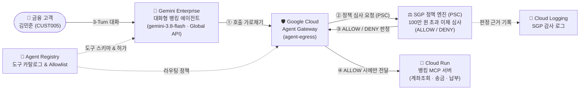

# **Gemini Enterprise와 Agent Gateway · 시맨틱 거버넌스 정책(SGP)을 활용한 자율형 AI 에이전트 거버넌스**

## **GSPxxxx** *(request a GSP number for any lab that might be considered for the public catalog)*

[[ import labmanuallogo ]]

# **Overview**

대규모 언어 모델(LLM) 기반의 자율형 AI 에이전트는 스스로 추론하고 워크플로를 오케스트레이션하며, 계좌 이체 API나 핵심 데이터베이스와 같은 엔터프라이즈 백엔드 도구를 직접 호출할 수 있습니다. 그러나 에이전트에게 백엔드 시스템에 대한 직접적인 네트워크 접근 권한을 부여하면 프롬프트 인젝션(Prompt Injection), 모델 환각(Hallucination), 또는 비인가 고액 거래로 인한 심각한 보안 및 금융 컴플라이언스 리스크가 발생합니다.

본 실습에서는 **에이펙스 자산운용(Apex Asset Management)**의 금융 보안 시나리오를 바탕으로, 에이전트 애플리케이션 코드를 수정하지 않고도 네트워크 경계에서 자연어 기반의 비즈니스 규정을 실시간으로 강제하는 방법을 학습합니다. **Gemini Enterprise Agent Runtime**에서 동작하는 대화형 뱅킹 에이전트(`gemini-3.8-flash`, Global Endpoint)가 **Google Cloud Agent Gateway(`agent-egress`)**와 **Semantic Governance Policies(SGP)**를 경유하여 Cloud Run 기반의 **뱅킹 MCP(Model Context Protocol) 서버**를 안전하게 호출하도록 제로 트러스트(Zero-Trust) 거버넌스 계층을 구축합니다.

* **WHY (중요성):** 에이전트 내부의 시스템 프롬프트만으로는 지능화된 프롬프트 우회 공격이나 런타임 오작동을 100% 차단할 수 없습니다. **Agent Gateway**와 **SGP**를 결합하면 모든 아웃바운드 도구 호출을 네트워크 경계에서 가로채어 **"1회 이체 금액이 100만 원(`amount <= 1000.0`)을 초과하는 모든 송금 요청은 즉시 차단한다"**와 같은 자연어 비즈니스 정책을 코드 변경 없이 결정론적으로 강제하고 감사 로그를 남길 수 있습니다.
* **HOW (학습 효과):** 실습자는 **Google Cloud Shell** 단일 환경에서 `gcloud` CLI, `curl`, `uv`, `agents-cli`만을 사용하여 Agent Gateway(`AGENT_TO_ANYWHERE`), Agent Registry 도구 카탈로그, Private Service Connect(PSC) 기반 SGP 정책 엔진 연결, 그리고 Gemini Enterprise Agent Runtime 비동기 배포 파이프라인을 처음부터 끝까지 직접 구축하고 3-Turn 시나리오로 검증합니다.
* **WHO (대상 직군):** 엔터프라이즈 AI 에이전트 아키텍처의 보안 가드레일과 네트워크 통제를 설계·운영하는 **클라우드 네트워크 엔지니어(Cloud Network Engineer)**, **AI 플랫폼 엔지니어(AI Platform Engineer)**, **보안 아키텍트(Security Architect / SecOps)** 및 **생성형 AI 애플리케이션 개발자**에게 적합합니다.



# **Objectives**

이 실습에서는 **Google Cloud Shell**을 사용하여 다음 작업을 수행하는 방법을 배웁니다:

* **Agent Gateway (`agent-egress`)** 구성을 위한 필수 Google Cloud API 활성화 및 관리형 서비스 에이전트(`roles/agentgateway.serviceAgent`) IAM 권한 구성
* 리전 관리형 프록시 전용 서브넷(`proxy-only-subnet`), Network Attachment(`agent-gateway-na`), 및 `AGENT_TO_ANYWHERE` 모드의 **Agent Gateway** 배포
* **Google Cloud Run**에 에이펙스 자산운용의 4대 금융 도구를 제공하는 **뱅킹 MCP 서버(`banking-mcp-server`)** 컨테이너 빌드 및 배포
* **Agent Registry**에 뱅킹 MCP 도구 명세(`toolspec.json`) 및 **Gemini Enterprise Global API(`https://aiplatform.googleapis.com`)**를 포함한 핵심 시스템 엔드포인트 등록과 IAP Egress(`roles/iap.egressor`) 권한 부여
* **Google ADK(Agent Development Kit)**로 구현된 대화형 뱅킹 에이전트(`gemini-3.8-flash`, `GOOGLE_CLOUD_LOCATION=global`)를 **Gemini Enterprise Agent Runtime**에 비동기(`--no-wait`)로 배포
* 백그라운드에서 에이전트가 프로비저닝되는 동안 **SGP(시맨틱 거버넌스 정책) 엔진** 활성화, **Private Service Connect(PSC)** 엔드포인트(`sgp-psc-endpoint`) 및 프라이빗 **Cloud DNS(`policy.internal.`)** 병렬 구성
* **Service Extensions(`AuthzExtension`)**, **네트워크 보안 인가 정책(`AuthzPolicy`)**, 및 100만 원 초과 송금을 차단하는 자연어 기반 **시맨틱 거버넌스 정책(`high-value-limit`)** 생성
* Cloud Shell에서 **3-Turn 금융 거래 시나리오(본인 확인 → 5만 원 소액 이체 `ALLOW` → 500만 원 고액 이체 `DENY`)** 실행 및 **Cloud Logging** 감사 로그 확인

## **Prerequisites**

이 실습을 원활하게 진행하려면 다음 항목에 대한 기본 지식이 권장됩니다:

* Google Cloud 콘솔 및 **Cloud Shell(`bash`)** 명령줄 기본 사용법
* VPC 서브넷, Private Service Connect(PSC), Cloud DNS 등 Google Cloud 네트워킹 기초 개념
* Python 기반 AI 에이전트(ADK) 및 Model Context Protocol(MCP)의 기본 동작 원리

# **Setup and requirements**

[[ import startqwiklab ]]

[[ import gcpconsole ]]

[[ import cloudshell ]]

## **사전 프로비저닝(Startup Script) 리소스 확인 및 실습 리포지토리 준비**

**Start Lab** 버튼을 클릭하면 Qwiklabs Terraform Startup Script(`terraform.zip`)가 백그라운드에서 실행되어 실습에 필요한 기본 인프라(**핵심 GCP API 13종 활성화, 전용 VPC 네트워크 `apex-wealth-vpc`, 리전 서브넷 `apex-subnet` (`10.10.0.0/24`), 기본 서비스 계정 `apex-agent-lab-sa`**)를 자동으로 사전 프로비저닝합니다.

모든 실습 과정은 별도의 로컬 환경 설정 없이 **Google Cloud Shell**에서 완결됩니다. Cloud Shell 터미널이 열리면 아래 단계를 순서대로 실행하여 환경을 준비하세요.

1. Cloud Shell에서 현재 로그인된 계정과 활성화된 Qwiklabs 프로젝트 ID를 확인합니다.

```bash
gcloud auth list
gcloud config list project
```

2. 만약 프로젝트 ID가 설정되어 있지 않다면, Qwiklabs 좌측 **Lab details** 패널에 표시된 **Project ID**로 프로젝트를 설정합니다.

```bash
gcloud config set project [YOUR_QWIKLABS_PROJECT_ID]
```

3. Cloud Shell 홈 디렉터리(`$HOME`)에 실습 코드 리포지토리를 클론하고 작업 디렉터리로 이동합니다.

```bash
cd ~
git clone https://github.com/wxdxh/agent-gateway-sgp.git
cd ~/agent-gateway-sgp
chmod +x *.sh
```

4. Gemini Enterprise Agent Runtime 패키징 및 배포에 사용되는 `uv`(Python 패키지 매니저)와 `google-agents-cli`를 Cloud Shell에 설치합니다.

```bash
curl -LsSf https://astral.sh/uv/install.sh | sh
export PATH="$HOME/.local/bin:$PATH"
echo 'export PATH="$HOME/.local/bin:$PATH"' >> ~/.bashrc

uv tool install google-agents-cli
agents-cli --version
```

5. 실습 전반에서 공통으로 사용할 환경 변수 스크립트(`env.sh`)를 로드하고, Startup Script가 사전 생성한 VPC(`apex-wealth-vpc`) 및 서브넷(`apex-subnet`)을 포함한 프로젝트 메타데이터가 정상 감지되는지 확인합니다.

```bash
cd ~/agent-gateway-sgp
source env.sh
```

정상적으로 로드되면 다음과 같은 환경 요약 정보가 출력됩니다:

```
==================================================
 Project ID:     qwiklabs-gcp-xx-xxxxxxxxxxxx
 Project Number: 1080321871308
 Location:       us-central1
 VPC Network:    apex-wealth-vpc
 VPC Subnet:     apex-subnet
 Agent GW SA:    serviceAccount:service-1080321871308@gcp-sa-agentgateway.iam.gserviceaccount.com
==================================================
```

> **참고:** 실습 도중 Cloud Shell 세션이 재연결되더라도 `$HOME/agent-gateway-sgp` 디렉터리와 `.env.runtime` 파일은 그대로 유지됩니다. 터미널이 재시작된 경우 아래 명령어 한 줄만 실행하면 즉시 이어서 진행할 수 있습니다:
> ```bash
> cd ~/agent-gateway-sgp && source env.sh && [[ -f .env.runtime ]] && source .env.runtime
> ```

&nbsp;

# **Task 1. 필수 Google Cloud API 활성화 및 서비스 에이전트 IAM 구성**

실습을 시작합니다! Qwiklabs Startup Script가 기본 API들을 사전 활성화해 두었으며, 첫 번째 작업에서는 Agent Registry, Model Armor, Telemetry 등 확장 API를 포함한 전체 16종의 API 활성화 상태를 최종 확인하고, Google 관리형 Agent Gateway 서비스 에이전트(`service-${PROJECT_NUM}@gcp-sa-agentgateway.iam.gserviceaccount.com`)를 프로비저닝하여 필수 IAM 권한을 부여합니다.

## **필수 API 활성화 및 Network Services 서비스 ID 생성**

1. Cloud Shell에서 아래 명령어를 실행하여 네트워킹, 보안, 에이전트 레지스트리 및 Gemini Enterprise 관련 필수 API 16종을 일괄 활성화(및 확인)합니다.

```bash
cd ~/agent-gateway-sgp
source env.sh

gcloud services enable \
  compute.googleapis.com \
  networksecurity.googleapis.com \
  networkservices.googleapis.com \
  dns.googleapis.com \
  iam.googleapis.com \
  iap.googleapis.com \
  agentregistry.googleapis.com \
  aiplatform.googleapis.com \
  run.googleapis.com \
  cloudbuild.googleapis.com \
  artifactregistry.googleapis.com \
  storage.googleapis.com \
  modelarmor.googleapis.com \
  telemetry.googleapis.com \
  cloudtrace.googleapis.com \
  logging.googleapis.com \
  --project="${PROJECT_ID}"
```

2. `networkservices.googleapis.com` API를 위한 Google 관리형 서비스 에이전트 ID를 생성합니다.

```bash
gcloud beta services identity create \
  --service=networkservices.googleapis.com \
  --project="${PROJECT_ID}" || true
```

## **Agent Gateway 서비스 에이전트 IAM 역할 바인딩**

1. 생성된 Agent Gateway 서비스 에이전트(`AGW_SA`)가 에이전트 트래픽을 중계하고 SGP 정책 엔진 및 Gemini Enterprise와 통신할 수 있도록 3가지 핵심 IAM 역할(`roles/agentgateway.serviceAgent`, `roles/aiplatform.user`, `roles/modelarmor.user`)을 부여합니다.

```bash
for ROLE in "roles/agentgateway.serviceAgent" "roles/aiplatform.user" "roles/modelarmor.user"; do
  echo "Granting ${ROLE} to ${AGW_SA}..."
  gcloud projects add-iam-policy-binding "${PROJECT_ID}" \
    --member="${AGW_SA}" \
    --role="${ROLE}" \
    --condition=None \
    --quiet
done
```

> **팁:** 위 1~2단계 과정은 리포지토리에 포함된 `./01-setup-env.sh` 스크립트를 실행하여 동일하게 수행할 수도 있습니다.

2. IAM 정책 바인딩이 정상적으로 완료되었는지 Cloud Shell에서 확인합니다.

```bash
gcloud projects get-iam-policy "${PROJECT_ID}" \
  --flatten="bindings[].members" \
  --filter="bindings.members:${AGW_SA}" \
  --format="table(bindings.role)"
```

&nbsp;

# **Task 2. Agent Gateway 네트워크 기반 및 `agent-egress` 게이트웨이 배포**

이 작업에서는 Gemini Enterprise Agent Runtime에서 외부 도구(MCP 서버) 및 시스템 API로 나가는 모든 아웃바운드 트래픽을 가로채어 통제하는 **Agent Gateway(`agent-egress`)**를 구축합니다. 이를 위해 리전 관리형 프록시 전용 서브넷(`proxy-only-subnet`)과 Network Attachment(`agent-gateway-na`)를 먼저 생성한 뒤, `AGENT_TO_ANYWHERE` 모드의 게이트웨이를 배포합니다.

## **리전 관리형 프록시 서브넷 및 Network Attachment 생성**

1. Agent Gateway 내부 Envoy 프록시 인스턴스들이 사용할 리전 관리형 프록시 전용 서브넷(`proxy-only-subnet`, `10.11.13.0/24`)을 생성합니다.

```bash
cd ~/agent-gateway-sgp
source env.sh

gcloud compute networks subnets create proxy-only-subnet \
  --network="${NETWORK_NAME}" \
  --region="${LOCATION}" \
  --range="10.11.13.0/24" \
  --purpose=REGIONAL_MANAGED_PROXY \
  --role=ACTIVE \
  --project="${PROJECT_ID}" || true
```

2. Google 관리형 테넌트 프로젝트에서 실행되는 Agent Gateway가 실습 프로젝트의 VPC(`default` 서브넷)로 이그레스 트래픽을 주입할 수 있도록 PSC 인터페이스 연결점인 **Network Attachment(`agent-gateway-na`)**를 생성합니다.

```bash
gcloud compute network-attachments create agent-gateway-na \
  --region="${LOCATION}" \
  --subnets="${SUBNET_NAME}" \
  --connection-preference=ACCEPT_AUTOMATIC \
  --project="${PROJECT_ID}" || true
```

## **`agent-egress` 게이트웨이 구성 파일 작성 및 배포**

1. `AGENT_TO_ANYWHERE` 거버넌스 경로, Agent Registry 연동, Network Attachment 및 `policy.internal.` 도메인에 대한 DNS 피어링 설정이 포함된 `agent-gateway-vpc-egress.yaml` 매니페스트 파일을 생성합니다.

```bash
cat > agent-gateway-vpc-egress.yaml << EOF
name: projects/${PROJECT_ID}/locations/${LOCATION}/agentGateways/agent-egress
protocols:
  - MCP
googleManaged:
  governedAccessPath: AGENT_TO_ANYWHERE
registries:
  - //agentregistry.googleapis.com/projects/${PROJECT_ID}/locations/${LOCATION}
networkConfig:
  egress:
    networkAttachment: projects/${PROJECT_ID}/regions/${LOCATION}/networkAttachments/agent-gateway-na
  dnsPeeringConfig:
    domains:
      - policy.internal.
    targetProject: ${PROJECT_ID}
    targetNetwork: projects/${PROJECT_ID}/global/networks/${NETWORK_NAME}
EOF
```

2. 작성한 YAML 매니페스트를 임포트하여 `agent-egress` 게이트웨이를 프로비저닝합니다.

```bash
gcloud network-services agent-gateways import agent-egress \
  --source=agent-gateway-vpc-egress.yaml \
  --location="${LOCATION}" \
  --project="${PROJECT_ID}"
```

> **팁:** 위 과정은 `./02-setup-agent-gateway.sh` 스크립트로도 한 번에 실행할 수 있습니다.

3. 배포된 `agent-egress` 게이트웨이의 상세 구성을 조회하여 정상 생성되었는지 확인합니다.

```bash
gcloud network-services agent-gateways describe agent-egress \
  --location="${LOCATION}" \
  --project="${PROJECT_ID}" \
  --format="yaml(name,googleManaged,networkConfig)"
```

&nbsp;

# **Task 3. Cloud Run에 에이펙스 자산운용 뱅킹 MCP 서버 배포**

이 작업에서는 에이펙스 자산운용의 핵심 뱅킹 백엔드 역할을 수행하는 **Model Context Protocol(MCP) 서버(`banking-mcp-server`)**를 Google Cloud Run에 배포합니다. 이 서버는 계좌 조회(`get_account`), 전화번호로 고객 조회(`lookup_customer_by_phone`), 간편 송금(`transfer_to_phone`), 공과금 납부(`pay_bill`)의 4가지 도구를 JSON-RPC 2.0(`/mcp`) 및 도구 명세 조회(`/tools`) 엔드포인트로 제공합니다.

## **뱅킹 MCP 서버 컨테이너 빌드 및 Cloud Run 배포**

1. `banking-mcp-server` 디렉터리로 이동하여 소스 코드로부터 컨테이너 이미지를 빌드하고 Cloud Run 서비스로 배포합니다.

```bash
cd ~/agent-gateway-sgp
source env.sh

cd ~/agent-gateway-sgp/banking-mcp-server
gcloud run deploy banking-mcp-server \
  --source=. \
  --region="${LOCATION}" \
  --project="${PROJECT_ID}" \
  --allow-unauthenticated \
  --quiet
cd ~/agent-gateway-sgp
```

2. 배포된 Cloud Run 서비스의 HTTPS 엔드포인트 URL을 조회하여 `MCP_URL` 환경 변수로 설정하고 `.env.runtime` 파일에 저장합니다.

```bash
export MCP_URL="$(gcloud run services describe banking-mcp-server \
  --region="${LOCATION}" \
  --project="${PROJECT_ID}" \
  --format="value(status.url)")"
echo "export MCP_URL=\"${MCP_URL}\"" > ~/agent-gateway-sgp/.env.runtime
echo "Banking MCP Server URL: ${MCP_URL}"
```

## **MCP 도구 엔드포인트 검증 및 Invoker 권한 부여**

1. 배포된 MCP 서버의 `/tools` 엔드포인트를 호출하여 4대 뱅킹 도구(`get_account`, `lookup_customer_by_phone`, `transfer_to_phone`, `pay_bill`)의 JSON 스키마가 정상 반환되는지 확인합니다.

```bash
ID_TOKEN="$(gcloud auth print-identity-token 2>/dev/null || true)"
curl -fsS -H "Authorization: Bearer ${ID_TOKEN}" "${MCP_URL}/tools" | python3 -m json.tool
```

2. Agent Gateway 서비스 에이전트(`AGW_SA`)가 Cloud Run의 `banking-mcp-server`를 호출할 수 있도록 `roles/run.servicesInvoker` 역할을 부여합니다.

```bash
gcloud run services add-iam-policy-binding banking-mcp-server \
  --region="${LOCATION}" \
  --member="${AGW_SA}" \
  --role="roles/run.servicesInvoker" \
  --project="${PROJECT_ID}"
```

> **팁:** 위 과정은 `./03-deploy-mcp.sh` 스크립트로도 한 번에 실행할 수 있습니다.

&nbsp;

# **Task 4. Agent Registry에 MCP 도구 및 Gemini Enterprise Global API 등록**

`AGENT_TO_ANYWHERE` 모드로 동작하는 Agent Gateway는 **기본 거부(Default Deny)** 원칙을 따릅니다. 즉, **Agent Registry**에 등록되고 IAP Egress(`roles/iap.egressor`) 권한이 부여된 목적지로만 에이전트의 아웃바운드 통신이 허용됩니다. 이 작업에서는 뱅킹 MCP 서버를 Agent Registry에 등록하고, 에이전트가 **`gemini-3.8-flash`** 모델을 **Global Endpoint(`https://aiplatform.googleapis.com`)**로 호출할 수 있도록 4대 핵심 시스템 API를 Allowlist에 등록합니다.

## **MCP 도구 명세(`toolspec.json`) 추출 및 Agent Registry 서비스 등록**

1. Cloud Run에 배포된 뱅킹 MCP 서버의 `/tools` 엔드포인트에서 도구 스키마를 추출하여 Agent Registry 규격의 `toolspec.json` 파일로 변환합니다.

```bash
cd ~/agent-gateway-sgp
source env.sh
source .env.runtime

ID_TOKEN="$(gcloud auth print-identity-token 2>/dev/null || true)"
curl -fsS -H "Authorization: Bearer ${ID_TOKEN}" "${MCP_URL}/tools" | \
  python3 -c 'import sys, json; tools=json.load(sys.stdin); json.dump({"tools": tools}, open("toolspec.json", "w"))'
```

2. 생성된 `toolspec.json`을 사용하여 **Agent Registry**에 `banking-mcp-server` 서비스를 등록합니다.

```bash
gcloud alpha agent-registry services create banking-mcp-server \
  --project="${PROJECT_ID}" \
  --location="${LOCATION}" \
  --display-name="Banking MCP Server" \
  --interfaces=url="${MCP_URL}/mcp",protocolBinding=JSONRPC \
  --mcp-server-spec-type=tool-spec \
  --mcp-server-spec-content="toolspec.json" || true
```

3. Agent Registry가 할당한 고유 MCP 서버 리소스 ID(`MCP_SERVER_NAME`, 예: `agentregistry-xxxx...`)를 조회하여 `.env.runtime` 파일에 저장합니다.

```bash
export MCP_SERVER_NAME="$(gcloud alpha agent-registry mcp-servers list \
  --project="${PROJECT_ID}" \
  --location="${LOCATION}" \
  --filter="displayName:'Banking MCP Server'" \
  --format="value(name.basename())" | head -n 1)"

echo "export MCP_SERVER_NAME=\"${MCP_SERVER_NAME}\"" >> ~/agent-gateway-sgp/.env.runtime
echo "Registered MCP Server ID: ${MCP_SERVER_NAME}"
```

## **Gemini Enterprise Global API 및 필수 시스템 엔드포인트 4종 Allowlist 등록**

1. 에이전트가 런타임에서 `gemini-3.8-flash` 모델 추론(`https://aiplatform.googleapis.com`), 도구 조회(`https://agentregistry.googleapis.com`), 트레이싱(`https://telemetry.googleapis.com`), 로깅(`https://logging.googleapis.com`)을 수행할 수 있도록 4개 시스템 엔드포인트를 Agent Registry에 등록하고 `roles/iap.egressor` 권한을 바인딩합니다.

```bash
ENDPOINTS=(
  "Gemini Enterprise Global API | https://aiplatform.googleapis.com"
  "Cloud Trace API | https://telemetry.googleapis.com"
  "Cloud Logging API | https://logging.googleapis.com"
  "Agent Registry API | https://agentregistry.googleapis.com"
)

for entry in "${ENDPOINTS[@]}"; do
  IFS="|" read -r name url <<< "$entry"
  name="$(echo "$name" | xargs)"
  url="$(echo "$url" | xargs)"
  service_id="$(echo "$name" | tr '[:upper:]' '[:lower:]' | tr -cd 'a-z0-9' | cut -c 1-40)"

  echo "Registering endpoint '${name}' (${url})..."
  res="$(gcloud alpha agent-registry services create "${service_id}" \
    --project="${PROJECT_ID}" \
    --location="${LOCATION}" \
    --display-name="${name}" \
    --endpoint-spec-type=no-spec \
    --interfaces=url="${url}",protocolBinding=JSONRPC \
    --format="value(registryResource)" 2>&1)" || true

  ep_id="$(echo "${res}" | grep -oE 'agentregistry-[0-9a-f-]+$' | head -n 1 || true)"
  if [[ -n "${ep_id}" ]]; then
    echo "Binding roles/iap.egressor on endpoint ${ep_id}..."
    gcloud alpha iap web add-iam-policy-binding \
      --resource-type=agent-registry \
      --endpoint="${ep_id}" \
      --region="${LOCATION}" \
      --project="${PROJECT_ID}" \
      --member="${AGW_SA}" \
      --role="roles/iap.egressor" \
      --quiet >/dev/null || true
    gcloud alpha iap web add-iam-policy-binding \
      --resource-type=agent-registry \
      --endpoint="${ep_id}" \
      --region="${LOCATION}" \
      --project="${PROJECT_ID}" \
      --member="serviceAccount:service-${PROJECT_NUM}@gcp-sa-aiplatform-re.iam.gserviceaccount.com" \
      --role="roles/iap.egressor" \
      --quiet >/dev/null || true
  fi
done
```

> **팁:** 위 과정은 `./04-register-mcp.sh` 스크립트로도 한 번에 실행할 수 있습니다.

2. Agent Registry에 등록된 전체 서비스 목록(뱅킹 MCP 서버 + 4대 시스템 엔드포인트)을 확인합니다.

```bash
gcloud alpha agent-registry services list \
  --project="${PROJECT_ID}" \
  --location="${LOCATION}" \
  --format="table(name.basename(),displayName)"
```

&nbsp;

# **Task 5. Gemini Enterprise Agent Runtime에 대화형 뱅킹 에이전트 비동기 배포**

**Gemini Enterprise Agent Runtime** 컨테이너 빌드 및 프로비저닝은 백엔드에서 약 15~20분이 소요됩니다. 실습 시간을 효율적으로 활용하기 위해, 에이전트 배포에 필요한 선행 리소스(`agent-egress` 게이트웨이 및 MCP 도구 등록)가 준비된 현 시점에 `--no-wait` 플래그로 **에이전트 배포를 비동기(백그라운드)로 먼저 시작**한 뒤, 기다리지 않고 즉시 **Task 6(SGP 네트워킹)**과 **Task 7(SGP 정책 생성)**을 병렬로 진행합니다.

## **에이전트 코드(`agent.py`)의 Global 엔드포인트 및 `gemini-3.8-flash` 구성 확인**

1. Cloud Shell에서 `conversational-banking/app/agent.py`의 핵심 구현을 확인합니다. 에이전트는 `GOOGLE_CLOUD_LOCATION="global"`을 설정하여 **`gemini-3.8-flash`** 모델 추론 요청이 **Gemini Enterprise Global API(`https://aiplatform.googleapis.com`)**로 전송되도록 하고, `AgentRegistry`를 통해 리전(`us-central1`)에 등록된 뱅킹 MCP 도구 세트를 동적으로 로드합니다.

```bash
cd ~/agent-gateway-sgp
grep -n -C 8 "gemini-3.8-flash" conversational-banking/app/agent.py
```

## **TLS Inspection Root CA 인증서 추출 및 비동기 배포 실행**

1. `agent-egress` 게이트웨이가 아웃바운드 HTTPS 페이로드를 복호화하여 SGP 정책 엔진으로 전달할 때 사용하는 전용 **Root CA 인증서**를 추출하여 에이전트 컨테이너 빌드 디렉터리(`conversational-banking/agent-gateway-ca.crt`)에 저장합니다.

```bash
cd ~/agent-gateway-sgp
source env.sh
source .env.runtime

gcloud network-services agent-gateways describe agent-egress \
  --location="${LOCATION}" \
  --project="${PROJECT_ID}" \
  --format="value(agentGatewayCard.rootCertificates[0])" > conversational-banking/agent-gateway-ca.crt
```

2. `agents-cli deploy` 명령어에 `--agent-identity`, `--agent-gateway-egress`, `GOOGLE_CLOUD_LOCATION=global`, `MODEL=gemini-3.8-flash`, 그리고 비동기 플래그인 `--no-wait`를 지정하여 **Gemini Enterprise Agent Runtime** 배포를 시작합니다.

```bash
export PATH="$HOME/.local/bin:$PATH"
cd ~/agent-gateway-sgp/conversational-banking
export UV_NO_CONFIG=1
export PIP_CONFIG_FILE=/dev/null

agents-cli deploy \
  --project="${PROJECT_ID}" \
  --region="${LOCATION}" \
  --deployment-target="agent_runtime" \
  --agent-identity \
  --agent-gateway-egress="projects/${PROJECT_ID}/locations/${LOCATION}/agentGateways/agent-egress" \
  --update-env-vars="MCP_SERVER_NAME=${MCP_SERVER_NAME},GOOGLE_CLOUD_LOCATION=global,LOCATION=${LOCATION},MODEL=gemini-3.8-flash,PROJECT_ID=${PROJECT_ID},GOOGLE_API_USE_MTLS_ENDPOINT=never,GOOGLE_API_USE_CLIENT_CERTIFICATE=false" \
  --no-wait

cd ~/agent-gateway-sgp
```

> **팁:** 위 과정은 `./05-deploy-agent.sh` 스크립트로도 한 번에 실행할 수 있습니다. 배포 요청이 접수되면 **완료될 때까지 기다리지 말고 즉시 Task 6으로 이동**하세요.

&nbsp;

# **Task 6. SGP 정책 엔진 활성화 · PSC 엔드포인트 및 프라이빗 Cloud DNS 구성**

백그라운드에서 Gemini Enterprise Agent Runtime이 프로비저닝되는 동안, `agent-egress` 게이트웨이가 Google 관리형 **Semantic Governance Policy(SGP) 엔진**과 사설망으로 통신할 수 있도록 **Private Service Connect(PSC)** 엔드포인트(`sgp-psc-endpoint`)와 프라이빗 **Cloud DNS(`policy.internal.`)**를 구성합니다.

## **VPC 내부 고정 IP 예약 및 SGP 엔진 Service Attachment 활성화**

1. 실습 VPC(`default` 서브넷) 내에 SGP PSC 엔드포인트가 사용할 내부 고정 IP(`sgp-psc-ip`)를 예약하고 할당된 IP 주소를 확인합니다.

```bash
cd ~/agent-gateway-sgp
source env.sh

gcloud compute addresses create sgp-psc-ip \
  --region="${LOCATION}" \
  --subnet="${SUBNET_NAME}" \
  --purpose=GCE_ENDPOINT \
  --project="${PROJECT_ID}" || true

export PSC_IP="$(gcloud compute addresses describe sgp-psc-ip \
  --region="${LOCATION}" \
  --project="${PROJECT_ID}" \
  --format="value(address)")"
echo "PSC IP reserved: ${PSC_IP}"
```

2. 프로젝트 리전(`us-central1`)에 SGP 정책 엔진을 활성화하고, Google 관리형 SGP 테넌트 프로젝트의 **PSC Service Attachment URI**를 동적으로 조회합니다.

```bash
SERVICE_ATTACHMENT="$(gcloud beta ai semantic-governance-policy-engine describe \
  --location="${LOCATION}" \
  --project="${PROJECT_ID}" \
  --format="value(pscServiceAttachment)" 2>/dev/null || true)"

if [[ -z "${SERVICE_ATTACHMENT}" ]]; then
  gcloud beta ai semantic-governance-policy-engine update \
    --location="${LOCATION}" \
    --project="${PROJECT_ID}" \
    --quiet
  SERVICE_ATTACHMENT="$(gcloud beta ai semantic-governance-policy-engine describe \
    --location="${LOCATION}" \
    --project="${PROJECT_ID}" \
    --format="value(pscServiceAttachment)" 2>/dev/null || true)"
fi

echo "Using SGP Service Attachment: ${SERVICE_ATTACHMENT}"
```

## **PSC 전달 규칙(Forwarding Rule) 및 프라이빗 Cloud DNS 구성**

1. 예약한 내부 IP(`sgp-psc-ip`)와 SGP 엔진의 `SERVICE_ATTACHMENT`를 연결하는 PSC 전달 규칙(`sgp-psc-endpoint`)을 생성합니다.

```bash
gcloud compute forwarding-rules create sgp-psc-endpoint \
  --region="${LOCATION}" \
  --network="${NETWORK_NAME}" \
  --address="sgp-psc-ip" \
  --target-service-attachment="${SERVICE_ATTACHMENT}" \
  --project="${PROJECT_ID}" || true
```

2. `agent-egress` 게이트웨이가 `policy.internal.` 도메인을 질의했을 때 방금 생성한 PSC 엔드포인트 IP(`${PSC_IP}`)로 응답하도록 프라이빗 Cloud DNS 영역(`policy-engine-zone`)과 A 레코드를 생성합니다.

```bash
gcloud dns managed-zones create policy-engine-zone \
  --description="Private zone for internal SGP service" \
  --dns-name="policy.internal." \
  --visibility=private \
  --networks="${NETWORK_NAME}" \
  --project="${PROJECT_ID}" || true

gcloud dns record-sets create policy.internal. \
  --zone=policy-engine-zone \
  --type=A \
  --ttl=300 \
  --rrdatas="${PSC_IP}" \
  --project="${PROJECT_ID}" || true
```

> **팁:** 위 과정은 `./06-setup-sgp-networking.sh` 스크립트로도 한 번에 실행할 수 있습니다.

3. PSC 엔드포인트 연결 상태가 `ACCEPTED`인지 확인합니다.

```bash
gcloud compute forwarding-rules describe sgp-psc-endpoint \
  --region="${LOCATION}" \
  --project="${PROJECT_ID}" \
  --format="table(name,IPAddress,pscConnectionStatus)"
```

&nbsp;

# **Task 7. 인가 확장(`AuthzExtension`), 인가 정책 및 자연어 SGP 정책 생성**

이 작업에서는 `agent-egress` 게이트웨이를 통과하는 도구 호출 페이로드를 PSC 터널(`policy.internal`) 너머의 SGP 정책 엔진으로 전달하기 위한 **Service Extensions 인가 확장(`sgp-authzextension`)**과 **콘텐츠 인가 정책(`agent-egress-sgp-authzpolicy`, `CONTENT_AUTHZ`)**을 구성합니다. 이어서 Task 5에서 비동기로 시작한 에이전트의 **Agent Identity(`AGENT_ID`)** 등록을 확인한 뒤, **1회 100만 원(`amount <= 1000.0`) 초과 이체를 차단하는 시맨틱 거버넌스 정책(`high-value-limit`)**을 배포합니다.

## **SGP 인가 확장(`sgp-authzextension`) 및 콘텐츠 인가 정책(`CONTENT_AUTHZ`) 바인딩**

1. `failOpen: false`(Fail-Closed 보안 원칙)로 설정된 SGP 인가 확장(`sgp-authzextension`)을 등록합니다.

```bash
cd ~/agent-gateway-sgp
source env.sh
source .env.runtime

ACCESS_TOKEN="$(gcloud auth print-access-token)"
curl -fsS -X POST \
  "https://networkservices.googleapis.com/v1beta1/projects/${PROJECT_ID}/locations/${LOCATION}/authzExtensions?authzExtensionId=sgp-authzextension" \
  -H "Authorization: Bearer ${ACCESS_TOKEN}" \
  -H "Content-Type: application/json" \
  -d '{
    "service": "policy.internal",
    "authority": "policy.internal",
    "failOpen": false,
    "loadBalancingScheme": "LOAD_BALANCING_SCHEME_UNSPECIFIED"
  }' || echo "Note: Authz extension might already exist."
```

2. `agent-egress` 게이트웨이를 타겟으로 하여 비-gRPC 콘텐츠 생성 및 MCP 도구 호출을 `sgp-authzextension`으로 위임하는 `agent-egress-sgp-authzpolicy.yaml` 매니페스트를 작성하고 임포트합니다.

```bash
cat > agent-egress-sgp-authzpolicy.yaml << EOF
name: projects/${PROJECT_ID}/locations/${LOCATION}/authzPolicies/agent-egress-sgp-authzpolicy
target:
  loadBalancingScheme: LOAD_BALANCING_SCHEME_UNSPECIFIED
  resources:
    - "projects/${PROJECT_NUM}/locations/${LOCATION}/agentGateways/agent-egress"
httpRules:
  - to:
      operations:
        - paths:
            - prefix: "/"
    when: '!request.headers["content-type"].startsWith("application/grpc") && (request.path.endsWith(":generateContent") || request.path.endsWith(":streamGenerateContent"))'
action: CUSTOM
policyProfile: CONTENT_AUTHZ
customProvider:
  authzExtension:
    resources:
      - "projects/${PROJECT_NUM}/locations/${LOCATION}/authzExtensions/sgp-authzextension"
EOF

gcloud beta network-security authz-policies import agent-egress-sgp-authzpolicy \
  --source=agent-egress-sgp-authzpolicy.yaml \
  --location="${LOCATION}" \
  --project="${PROJECT_ID}"
```

## **에이전트 등록 완료 확인 및 자연어 시맨틱 거버넌스 정책(`high-value-limit`) 생성**

1. Task 5에서 백그라운드로 시작한 `conversational-banking` 에이전트가 Agent Registry에 등록될 때까지 20초 간격으로 확인하여 `AGENT_ID`를 추출합니다.

```bash
export AGENT_ID="$(gcloud alpha agent-registry agents list \
  --project="${PROJECT_ID}" \
  --location="${LOCATION}" \
  --filter="displayName:'conversational-banking'" \
  --format="value(name.basename())" 2>/dev/null | head -n 1 || true)"

while [[ -z "${AGENT_ID}" ]]; do
  echo "Waiting for background Agent Runtime deployment to register in Agent Registry... (20s)"
  sleep 20
  export AGENT_ID="$(gcloud alpha agent-registry agents list \
    --project="${PROJECT_ID}" \
    --location="${LOCATION}" \
    --filter="displayName:'conversational-banking'" \
    --format="value(name.basename())" 2>/dev/null | head -n 1 || true)"
done

echo "export AGENT_ID=\"${AGENT_ID}\"" >> ~/agent-gateway-sgp/.env.runtime
echo "Registered Agent ID: ${AGENT_ID}"
```

2. 추출된 `AGENT_ID`와 `MCP_SERVER_NAME`, 그리고 ADK 런타임 도구 식별자인 `Banking_MCP_Server_transfer_to_phone`을 지정하여 **100만 원(`USD 1000` / `amount: 1000`) 초과 송금을 차단하는 자연어 거버넌스 정책(`high-value-limit`)**을 생성합니다.

```bash
TOOL_NAME="Banking_MCP_Server_transfer_to_phone"

gcloud beta ai semantic-governance-policies create high-value-limit \
  --project="${PROJECT_ID}" \
  --location="${LOCATION}" \
  --display-name="High Value Transfer Limit" \
  --agent="projects/${PROJECT_ID}/locations/${LOCATION}/agents/${AGENT_ID}" \
  --mcp-tools="mcp-server=projects/${PROJECT_ID}/locations/${LOCATION}/mcpServers/${MCP_SERVER_NAME},tools=${TOOL_NAME}" \
  --natural-language-constraint="Block any transfer value exceeding USD 1000." || \
gcloud beta ai semantic-governance-policies update high-value-limit \
  --project="${PROJECT_ID}" \
  --location="${LOCATION}" \
  --agent="projects/${PROJECT_ID}/locations/${LOCATION}/agents/${AGENT_ID}" \
  --mcp-tools="mcp-server=projects/${PROJECT_ID}/locations/${LOCATION}/mcpServers/${MCP_SERVER_NAME},tools=${TOOL_NAME}" \
  --natural-language-constraint="Block any transfer value exceeding USD 1000."
```

> **팁:** 위 1~2단계 전체 과정(에이전트 대기 폴링 및 정책 생성/업데이트 포함)은 `./07-create-sgp-policy.sh` 스크립트로도 한 번에 실행할 수 있습니다.

3. 생성된 `high-value-limit` 시맨틱 거버넌스 정책의 상세 설정을 확인합니다.

```bash
gcloud beta ai semantic-governance-policies describe high-value-limit \
  --location="${LOCATION}" \
  --project="${PROJECT_ID}"
```

&nbsp;

# **Task 8. 3-Turn 금융 거버넌스 시나리오 검증 및 Cloud Logging 감사 로그 확인**

모든 인프라와 정책 구성이 완료되었습니다! 이제 Cloud Shell에서 자동화된 3-Turn 시나리오 검증 스크립트(`08-test.sh` / `run_tests.py`)를 실행하여 **계좌 조회(Turn 1)**와 **5만 원 소액 송금(Turn 2)**은 정상 허용(`ALLOW`)되고, **200만 원 고액 송금(Turn 3)**은 네트워크 경계의 Agent Gateway + SGP 엔진에 의해 즉시 차단(`DENY`)되는지 확인합니다.

## **Cloud Shell에서 3-Turn E2E 검증 실행**

1. Cloud Shell에서 아래 명령어를 실행하여 Gemini Enterprise Agent Runtime에 배포된 `conversational-banking` 에이전트를 대상으로 3-Turn 시나리오 테스트를 수행합니다.

```bash
cd ~/agent-gateway-sgp
./08-test.sh
```

2. 터미널 출력에서 각 Turn의 도구 호출 결과와 SGP 판정을 확인합니다:
   * **Turn 1 (`I am customer CUST005`):** `get_account` 도구가 호출되어 고객(Alice Smith / 김민준)의 현재 잔액 **1,000만 원(`$10,000.00`)**이 정상 조회됩니다.
   * **Turn 2 (`transfer 50 to 555-0001`):** 1회 한도(100만 원 / `$1,000`) 이하인 **5만 원(`amount: 50`)** 송금 요청에 대해 SGP가 **`ALLOW`**로 판정하여 이체가 완료되고 잔액이 **995만 원(`$9,950.00`)**으로 차감됩니다.
   * **Turn 3 (`transfer 2000 to 555-0002`):** 1회 한도를 초과하는 **200만 원(`amount: 2000`)** 송금 요청에 대해 SGP가 **`DENY`**로 판정하여 Cloud Run 백엔드에 도달하기 전에 Agent Gateway에서 즉시 차단됩니다.

```
================================================================================
 Starting 3-Turn E2E Verification on Engine: projects/.../reasoningEngines/...
================================================================================

--------------------------------------------------------------------------------
[Turn 1 - Identify Customer]
Prompt: I am customer CUST005
--------------------------------------------------------------------------------
Agent Response:
Hello Alice Smith! I have retrieved your account (ACT-1005). Your current balance is $10,000.00. How can I help you today?
✓ Turn 1 PASSED (Customer identified & balance retrieved)

--------------------------------------------------------------------------------
[Turn 2 - Allowed Transfer (< $1,000 USD)]
Prompt: transfer 50 to 555-0001
--------------------------------------------------------------------------------
Agent Response:
Your transfer of $50.00 to Bob Jones (555-0001) has been completed successfully. Your new balance is $9,950.00.
✓ Turn 2 PASSED (Under-limit transfer of $50 allowed and processed)

--------------------------------------------------------------------------------
[Turn 3 - Blocked Transfer (> $1,000 USD by SGP)]
Prompt: transfer 2000 to 555-0002
--------------------------------------------------------------------------------
Agent Response:
I'm sorry, I cannot complete the transfer of $2,000.00 to 555-0002 because it exceeds the maximum allowed limit of $1,000.00 per transaction enforced by our security policy.
✓ Turn 3 PASSED (Over-limit transfer of $2000 blocked by SGP!)
```

## **Cloud Logging에서 SGP 감사 로그(`semantic-governance-policy`) 조회**

1. Cloud Shell에서 아래 명령어를 실행하여 SGP 정책 엔진이 남긴 실시간 감사 로그(`ALLOW` / `DENY` 판정 및 LLM-as-judge 차단 사유 `rationale`)를 직접 확인합니다.

```bash
cd ~/agent-gateway-sgp
source env.sh

gcloud logging read \
  "logName=\"projects/${PROJECT_ID}/logs/semantic-governance-policy\"" \
  --project="${PROJECT_ID}" \
  --limit=5 \
  --format=json
```

&nbsp;

# **Task 9. 리소스 정리 (선택 사항)**

실습 완료 후 불필요한 클라우드 리소스 과금을 방지하려면 생성한 SGP 정책, Cloud Run 서비스, Agent Gateway, DNS 영역 및 PSC 엔드포인트를 일괄 정리할 수 있습니다. (Qwiklabs 임시 프로젝트 환경에서는 랩 종료 시 프로젝트가 자동 삭제됩니다.)

## **클라우드 리소스 일괄 삭제**

* Cloud Shell에서 아래 정리 스크립트를 실행하여 생성된 리소스를 역순으로 안전하게 삭제합니다.

```bash
cd ~/agent-gateway-sgp
./99-cleanup.sh
```

&nbsp;

# **Congratulations!**

축하합니다! 본 실습을 통해 **Gemini Enterprise Agent Runtime(`gemini-3.8-flash`, Global Endpoint)**에서 실행되는 자율형 AI 에이전트의 아웃바운드 도구 호출을 **Google Cloud Agent Gateway(`agent-egress`)**와 **Semantic Governance Policies(SGP)**로 보호하는 엔드투엔드 제로 트러스트 거버넌스 아키텍처를 성공적으로 구축했습니다. 여러분은 **Agent Registry** 기반의 동적 도구 디스커버리와 시스템 엔드포인트 Allowlist 통제, **Private Service Connect(PSC)**를 통한 SGP 정책 엔진 사설망 연동, 그리고 자연어 비즈니스 제약 조건(`high-value-limit`) 정의 방법을 모두 마스터했습니다. 이제 실제 엔터프라이즈 환경에서도 에이전트 애플리케이션 코드를 전혀 수정하지 않고 네트워크 경계에서 고위험 금융 거래나 비인가 API 호출을 실시간으로 차단하고 감사할 수 있습니다.

## **Next steps / learn more**

* [Gemini Enterprise Agent Platform — Agent Gateway 개요](https://docs.cloud.google.com/gemini-enterprise-agent-platform/govern/gateways/agent-gateway-overview)
* [Agent Registry를 활용한 에이전트 및 MCP 도구 카탈로그 관리](https://docs.cloud.google.com/gemini-enterprise-agent-platform/govern/agent-registry)
* [Agent Identity 및 IAP 기반 제로 트러스트 권한 제어](https://docs.cloud.google.com/gemini-enterprise-agent-platform/govern/agent-identity-overview)
* [Google Agent Development Kit (ADK) 공식 문서](https://google.github.io/adk-docs/)

&nbsp;

[[ import TrainingCertificationOverview ]]

&nbsp;

***Manual Last Updated: October 7, 2026*** 

***Lab Last Tested: October 7, 2026***

&nbsp;

[[ import copyright ]]
