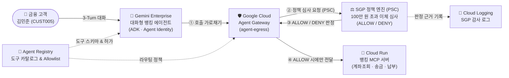

# Gemini Enterprise와 Agent Gateway · 시맨틱 거버넌스 정책(SGP)을 활용한 엔터프라이즈 AI 에이전트 거버넌스

본 저장소는 Google Cloud의 **Gemini Enterprise**, **Agent Gateway**, **Semantic Governance Policies (SGP)**를 결합하여 자율형 AI 에이전트의 도구 호출(Tool Invocation)을 네트워크 경계에서 실시간으로 통제하고 감사하는 종합 레퍼런스 아키텍처 및 실습 코드셋입니다.

> 📘 **상세 아키텍처 & 코드랩 실습 지침서**: **[`CODELAB_INSTRUCTIONS_KO.md`](./CODELAB_INSTRUCTIONS_KO.md)**  
> ☁️ **Qwiklabs · Cloud Shell 전용 핸즈온 인스트럭션**: **[`QWIKLABS_CLOUD_SHELL_KO.md`](./QWIKLABS_CLOUD_SHELL_KO.md)** | **[웹 코드랩 (Qwiklabs · Cloud Shell 탭 바로가기)](https://agent-gateway-codelab-1080321871308.us-central1.run.app/?mode=qwiklabs)**

---

## 🏦 비즈니스 시나리오: 에이펙스 자산운용 (Apex Asset Management)

국내 금융사인 **에이펙스 자산운용**은 고객이 대화만으로 계좌 조회, 간편 송금, 공과금 납부를 수행할 수 있도록 **Gemini Enterprise** 기반의 대화형 뱅킹 에이전트를 도입했습니다. 금융보안 및 준법감시팀은 보이스피싱 및 고액 오송금 사고를 예방하기 위해, 에이전트 코드를 수정하지 않고도 다음의 비즈니스 규정을 네트워크 경계에서 강제합니다:

> **핵심 거버넌스 규정**: *"1회 이체 금액이 100만 원(1,000,000 KRW / 1,000 USD)을 초과하는 모든 송금 요청은 네트워크 경계에서 즉시 차단하고 감사 로그를 남긴다."*



---

## ⏱️ 한눈에 보는 실습 로드맵 (총 예상 시간: 약 45분)

> **⚡ 병렬 파이프라인 설계 안내**:  
> **Gemini Enterprise Agent Runtime** 프로비저닝은 백엔드에서 약 15~20분이 소요됩니다. 본 코드랩은 에이전트 배포에 필수적인 최소 선행 리소스(`agent-egress` 게이트웨이 및 MCP 도구 등록)를 먼저 완료한 뒤, **Step 6(`05-deploy-agent.sh`)에서 에이전트 배포를 비동기(`--no-wait`)로 시작**하고 백그라운드에서 빌드되는 동안 **Step 7(SGP PSC 네트워킹 및 DNS 구성)**과 **Step 8(인가 확장 및 SGP 정책 생성)**을 병렬로 진행합니다.

| 단계 | 실행 스크립트 | 핵심 작업 | 예상 시간 | 실무 체크포인트 |
| :---: | :--- | :--- | :---: | :--- |
| **Step 1** | [`CODELAB_INSTRUCTIONS_KO.md`](./CODELAB_INSTRUCTIONS_KO.md) | 에이펙스 자산운용 시나리오 및 아키텍처 이해 | **5분** | 네트워크 경계 기반 정책 통제 구조 파악 |
| **Step 2** | `01-setup-env.sh` | 필수 API 활성화 및 Gateway 서비스 계정 권한 부여 | **3분** | `roles/agentgateway.serviceAgent` 필수 |
| **Step 3** | `02-setup-agent-gateway.sh` | Proxy-Only 서브넷, Network Attachment, `agent-egress` 생성 | **3분** | `AGENT_TO_ANYWHERE` Egress 게이트웨이 생성 |
| **Step 4** | `03-deploy-mcp.sh` | Cloud Run에 뱅킹 MCP 서버 배포 및 Invoker 권한 부여 | **3분** | 4대 뱅킹 도구 스키마 응답 확인 |
| **Step 5** | `04-register-mcp.sh` | Agent Registry에 MCP 도구 및 4대 시스템 API 등록 | **3분** | 시스템 엔드포인트 4종 `roles/iap.egressor` 바인딩 |
| **Step 6** | `05-deploy-agent.sh` | **🚀 Gemini Enterprise 에이전트 런타임 비동기 배포 시작** | **2분 (백그라운드 15분)** | **`--no-wait` 배포 시작 후 즉시 Step 7 진행** |
| **Step 7** | `06-setup-sgp-networking.sh` | **(병렬 진행 1)** SGP 엔진 활성화, PSC 엔드포인트, 프라이빗 DNS 구성 | **5분** | PSC 연결(`ACCEPTED`) 및 `policy.internal.` 구성 |
| **Step 8** | `07-create-sgp-policy.sh` | **(병렬 진행 2)** AuthzExtension, AuthzPolicy 및 고액 이체 차단 SGP 정책 생성 | **5분** | `high-value-limit` 시맨틱 거버넌스 정책 바인딩 |
| **Step 9** | `08-test.sh` / `run_tests.py` | 3-Turn 시나리오 검증 및 Cloud Logging 감사 확인 | **5분** | 소액 이체 `ALLOW` / 고액 이체 `DENY` |

---

## 📂 프로젝트 디렉터리 구조

```text
agentgateway/
├── CODELAB_INSTRUCTIONS_KO.md      # 📘 단계별 한국어 Quicklab 실습 지침서 (Markdown)
├── codelab-ko.html                 # 🌐 대화형 한국어 Codelab 웹 가이드 (SVG 다이어그램 포함)
├── index.html                      # GitHub Pages / Cloud Run용 대화형 Codelab 메인 페이지
│
├── banking-mcp-server/             # 에이펙스 자산운용 뱅킹 MCP 서버
│   ├── server.py                   # Model Context Protocol JSON-RPC 2.0 & /tools 엔드포인트
│   ├── Dockerfile                  # Cloud Run 배포용 컨테이너 명세
│   ├── requirements.txt            # Python 패키지 의존성
│   └── test_server.py              # 도구 기능 및 프로토콜 규격 단위 테스트
│
├── conversational-banking/         # Gemini Enterprise 에이전트 런타임용 대화형 에이전트
│   ├── app/
│   │   ├── agent.py                # Agent Registry 기반 동적 MCP 도구 바인딩 에이전트
│   │   └── fast_api_app.py         # 로컬 및 런타임용 서비스 래퍼
│   ├── Dockerfile                  # Agent Gateway TLS 신뢰 환경이 구성된 컨테이너
│   ├── pyproject.toml              # ADK 및 Agent Identity/MCP 통합 패키지 정의
│   └── agents-cli-manifest.yaml    # Agents CLI 프로젝트 매니페스트
│
├── env.sh                          # 프로젝트 공통 환경 변수 및 자동 감지 설정
├── 01-setup-env.sh                 # [Step 2] 필수 API 활성화 및 Gateway 서비스 계정 IAM 설정
├── 02-setup-agent-gateway.sh       # [Step 3] Proxy Subnet, Network Attachment, agent-egress 게이트웨이 생성
├── 03-deploy-mcp.sh                # [Step 4] Cloud Run에 뱅킹 MCP 서버 배포 및 Invoker IAM 부여
├── 04-register-mcp.sh              # [Step 5] Agent Registry 도구 등록 및 시스템 API Allowlist 등록
├── 05-deploy-agent.sh              # [Step 6] Gemini Enterprise 에이전트 런타임 배포
├── 06-setup-sgp-networking.sh      # [Step 7] SGP 엔진 활성화, PSC 엔드포인트, 프라이빗 Cloud DNS 구성
├── 07-create-sgp-policy.sh         # [Step 8] AuthzExtension, AuthzPolicy 및 시맨틱 거버넌스 정책 생성
├── 08-test.sh                      # [Step 9] 대화형 및 자동화 종합 검증 실행 스크립트
├── run_tests.py                    # E2E 3-Turn 자동화 검증 및 SGP 감사 로그 확인 스크립트
├── 99-cleanup.sh                   # 생성된 클라우드 리소스 일괄 정리 스크립트
└── deploy-all.sh                   # 전체 배포 파이프라인 일괄 실행 스크립트
```

---

## 🚀 빠른 실행 가이드

### 1. 일괄 배포 실행
```bash
./deploy-all.sh
```

### 2. 단계별 수동 배포 및 검증
상세한 단계별 설명과 스크립트 내부 동작 원리는 **[`CODELAB_INSTRUCTIONS_KO.md`](./CODELAB_INSTRUCTIONS_KO.md)** 문서를 참고하세요.

```bash
./01-setup-env.sh                 # Step 2: API 활성화 및 IAM 권한 설정
./02-setup-agent-gateway.sh       # Step 3: Proxy Subnet, Network Attachment, agent-egress 생성
./03-deploy-mcp.sh                # Step 4: Cloud Run에 뱅킹 MCP 서버 배포
./04-register-mcp.sh              # Step 5: Agent Registry에 MCP 서버 및 시스템 API 등록
./05-deploy-agent.sh              # Step 6: Gemini Enterprise 에이전트 런타임 배포
./06-setup-sgp-networking.sh      # Step 7: SGP 엔진 활성화, PSC 및 Cloud DNS 구성
./07-create-sgp-policy.sh         # Step 8: AuthzExtension, AuthzPolicy 및 SGP 정책 생성
./08-test.sh                      # Step 9: 3-Turn 자동화 검증 및 Cloud Logging 감사 로그 확인
```

---

## 🔍 3-Turn 시나리오 검증 요약

| 대화 순서 | 고객 입력 프롬프트 | SGP 판정 | 에이전트 최종 응답 |
| :---: | :--- | :---: | :--- |
| **Turn 1**<br/>(본인 확인) | `저는 고객번호 CUST005입니다`<br/>*(또는 `I am customer CUST005`)* | **`ALLOW`** | 안녕하세요! 계좌(`ACT-1005`)의 현재 잔액은 **10,000,000원(10,000 USD)**입니다. 무엇을 도와드릴까요? |
| **Turn 2**<br/>(소액 송금) | `555-0001로 5만 원(50) 이체해 줘`<br/>*(또는 `transfer 50 to 555-0001`)* | **`ALLOW`** | 수취인(`555-0001`)에게 정상 이체되었습니다. 거래번호: `TXN-C0832A85`, 남은 잔액: **9,950,000원(9,950 USD)** |
| **Turn 3**<br/>(고액 차단) | `555-0002로 200만 원(2000) 이체해 줘`<br/>*(또는 `transfer 2000 to 555-0002`)* | **`DENY`** | 죄송합니다. 요청하신 이체 금액이 **'고액 이체 한도 정책(High Value Transfer Limit)'의 1회 한도(100만 원 / 1,000 USD)를 초과**하여 거래를 진행할 수 없습니다. |

---

## 🧹 리소스 정리

```bash
./99-cleanup.sh
```
